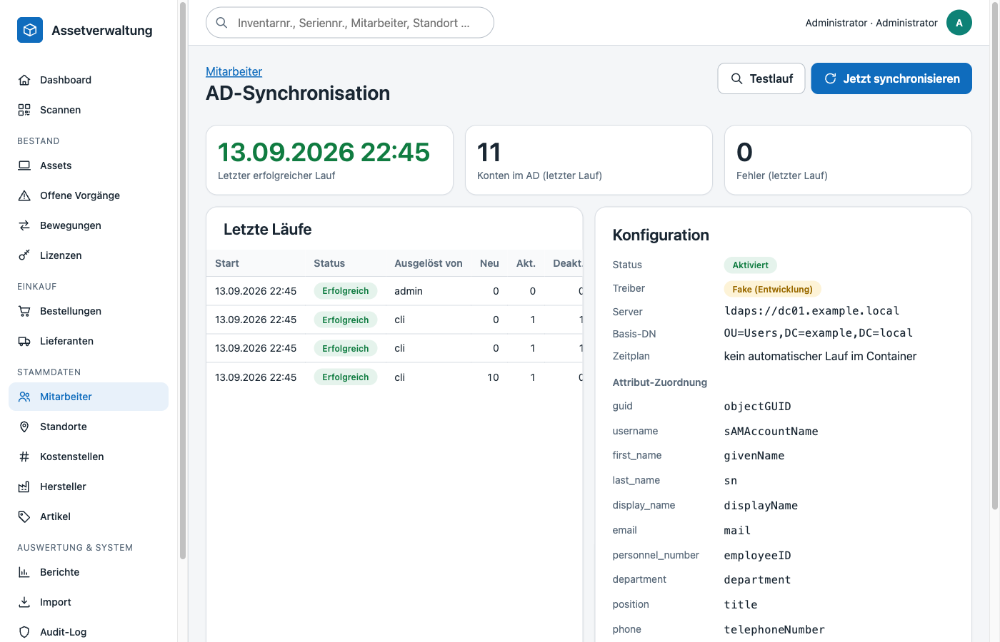
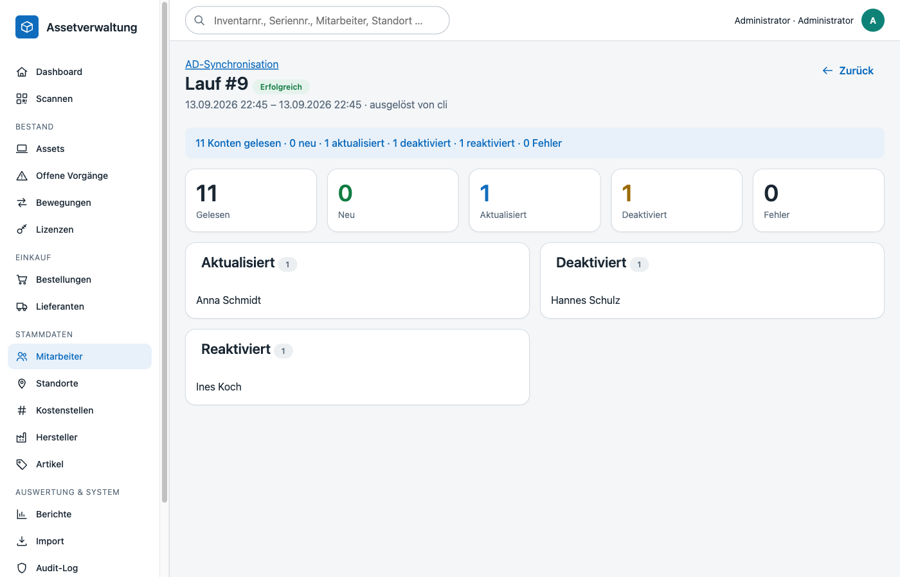

# Active-Directory-Synchronisation

Mitarbeiter werden nicht manuell gepflegt, sondern aus dem Active Directory (LDAP/LDAPS) übernommen.



## Grundsätze

| Regel | Umsetzung |
|---|---|
| Stabile Identität | Zuordnung ausschließlich über die `objectGUID` (Spalte `employees.ad_object_guid`, UNIQUE). Benutzername oder Name sind **nie** Primärschlüssel – Umbenennungen im AD aktualisieren denselben Datensatz. |
| Nichts löschen | Konten, die im AD fehlen oder das `ACCOUNTDISABLE`-Bit tragen, werden auf `is_active = 0` gesetzt (`deactivated_at`). Historische Assetzuordnungen und Bewegungen bleiben erhalten. |
| Reaktivierung | Kehrt eine GUID aktiv zurück, wird der Datensatz reaktiviert. |
| Lokale Zuordnungen | `location_id` und `cost_center_id` werden nur automatisch gesetzt, wenn sie leer sind (AD-Text passt eindeutig auf Standortname/-kürzel/-pfad bzw. 5-stellige Kostenstellennummer). Manuelle Zuordnungen überschreibt der Sync nicht. |
| Übernahme manueller Datensätze | Ein manuell angelegter Mitarbeiter ohne GUID mit identischem Benutzernamen wird beim ersten Sync übernommen (GUID gesetzt, `source = ad`) statt dupliziert. |
| Keine Geheimnisse im Code | Alle Zugangsdaten stehen ausschließlich in der `.env`. |

## Konfiguration (`.env`)

```ini
AD_ENABLED=true
AD_DRIVER=ldap                    # ldap (produktiv) | fake (Entwicklung/Tests)
AD_HOST=dc01.example.local        # Hostname, FQDN oder IP; Schema (ldaps://) optional
AD_PORT=636                       # 636 = LDAPS, 389 = LDAP
AD_BASE_DN=OU=Users,DC=example,DC=local
AD_BIND_DN=CN=svc-assets,OU=Service,DC=example,DC=local
AD_BIND_PASSWORD=…
AD_USER_FILTER=(&(objectClass=user)(objectCategory=person)(!(objectClass=computer)))

# Attribut-Mapping (jedes Feld frei konfigurierbar)
AD_ATTR_GUID=objectGUID
AD_ATTR_USERNAME=sAMAccountName
AD_ATTR_FIRST_NAME=givenName
AD_ATTR_LAST_NAME=sn
AD_ATTR_DISPLAY_NAME=displayName
AD_ATTR_EMAIL=mail
AD_ATTR_PERSONNEL_NUMBER=employeeID
AD_ATTR_DEPARTMENT=department
AD_ATTR_POSITION=title
AD_ATTR_PHONE=telephoneNumber
AD_ATTR_LOCATION=physicalDeliveryOfficeName
AD_ATTR_COST_CENTER=extensionAttribute1
AD_ATTR_ACCOUNT_CONTROL=userAccountControl

# Zeitsteuerung im App-Container (Minuten, 0 = aus)
AD_SYNC_INTERVAL_MINUTES=360
```

Die aktuelle Zuordnung wird unter **Mitarbeiter → AD-Synchronisation** angezeigt.

## Ausführung

**Manuell (Web):** Mitarbeiter → AD-Synchronisation → *Jetzt synchronisieren*. *Testlauf* zeigt das Ergebnis, rollt aber alle Änderungen zurück (Berechtigung `employees.sync`, Rollen Admin und Assetmanagement).

**Kommandozeile / Cron:**

```bash
docker compose exec app php bin/sync-ad.php            # Exit 0 = ok, 1 = Fehler, 2 = deaktiviert
docker compose exec app php bin/sync-ad.php --dry-run
```

**Zeitgesteuert:** Entweder `AD_SYNC_INTERVAL_MINUTES` setzen (ein Hintergrundprozess im App-Container ruft den Sync im Intervall auf) oder klassisch per Host-Cron:

```cron
15 */6 * * *  cd /opt/assets && docker compose exec -T app php bin/sync-ad.php --quiet --by=cron
```

Jeder Lauf wird in `ad_sync_runs` protokolliert (Zähler, Meldung, Details mit Namenslisten) und ist in der Weboberfläche einsehbar.



## Entwicklung ohne AD

`AD_DRIVER=fake` liest Einträge aus `database/fixtures/fake-ad-users.json` (Liste von Objekten „LDAP-Attribut → Wert“, `userAccountControl` 512 = aktiv, 514 = deaktiviert). Damit lassen sich alle Sync-Pfade lokal durchspielen; die Integrationstests nutzen denselben Treiber mit In-Memory-Daten.

## Ablauf im Detail

1. Bind mit Dienstkonto, seitenweise Suche (`LDAP_CONTROL_PAGEDRESULTS`, 500 Einträge/Seite).
2. Jeder Eintrag wird über `AdUserMapper` in Employee-Felder übersetzt; binäre GUIDs werden in die kanonische Textform konvertiert.
3. Pro GUID: anlegen / aktualisieren / deaktivieren / reaktivieren. Alles in einer Transaktion.
4. Alle `source = ad`-Datensätze, deren GUID nicht gesehen wurde, werden deaktiviert.
5. Ergebnis in `ad_sync_runs`; hängende Läufe (> 60 min „running“) werden beim nächsten Start als fehlgeschlagen markiert.
