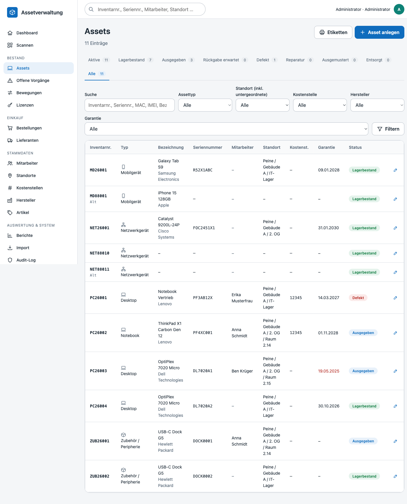
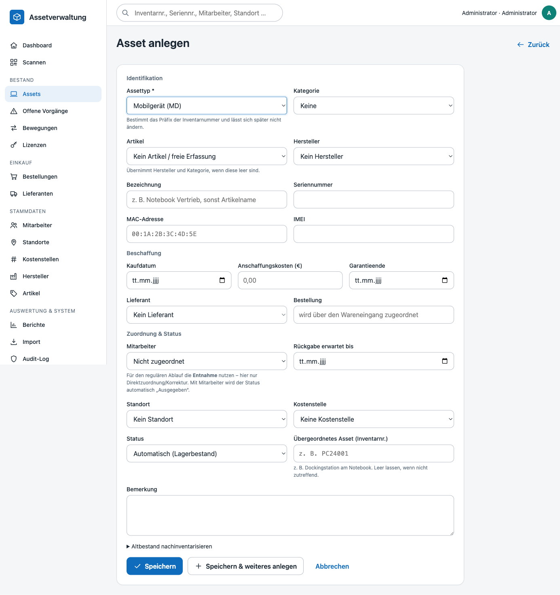
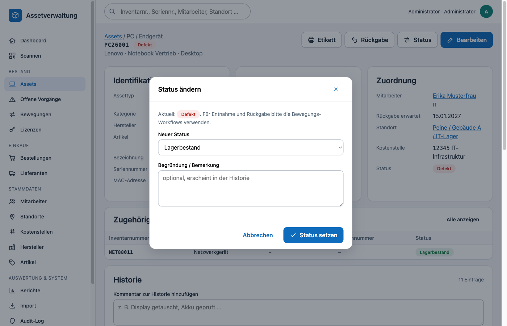
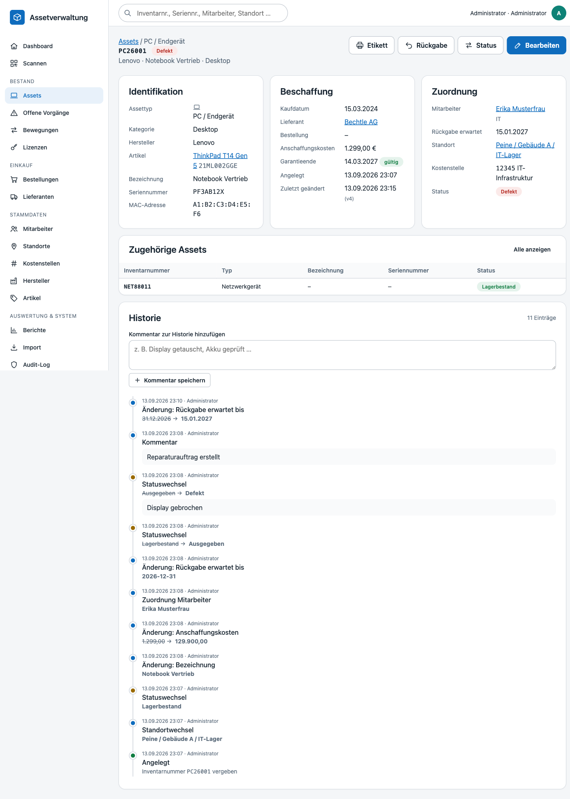
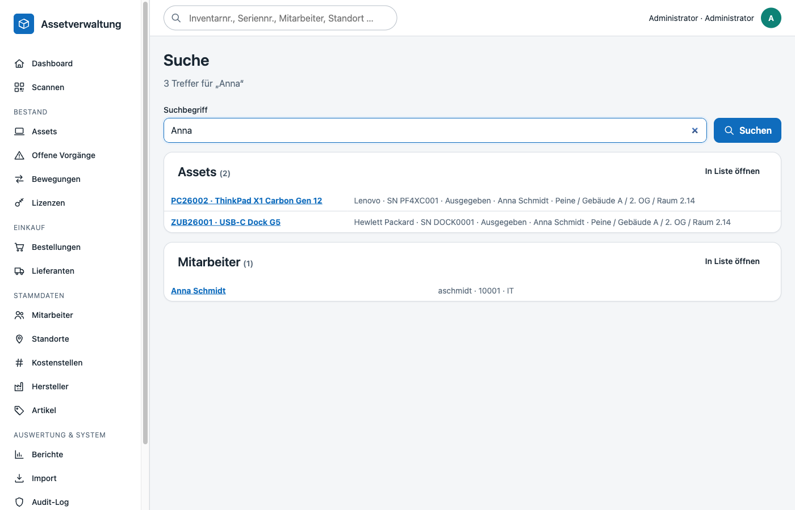

# Assets (Inventar)

Das Asset ist das zentrale Objekt der Anwendung. Jedes physische Gerät erhält genau eine Inventarnummer, die auf dem Etikett steht und über die gesamte Lebensdauer erhalten bleibt.

## Inventarnummern

| Bestandteil | Bedeutung | Beispiel |
|---|---|---|
| Präfix | Buchstabenkürzel des Assettyps (`asset_types.inventory_prefix`) | `PC`, `MD`, `NET`, `ZUB` |
| Jahr | zweistelliges Jahr der Anlage | `26` |
| Laufnummer | mindestens dreistellig, pro Präfix **und** Jahr fortlaufend; ab 1000 wird sie länger (kein Überlauf) | `001` … `999`, `1000` |
| Altbestand | Jahreskennung `88` für nachinventarisierte Geräte ohne bekanntes Anschaffungsjahr | `PC88001` |

Regeln:

- Die Vergabe läuft transaktional über `inventory_sequences` (`SELECT … FOR UPDATE`), sodass parallel angelegte Assets niemals dieselbe Nummer erhalten.
- Wurden Nummern manuell oder per Import vergeben, springt die Sequenz automatisch hinter die höchste vorhandene Nummer (`InventoryNumberService::next`).
- Manuelle Nummern sind nur bei „Altbestand nachinventarisieren“ möglich. Sie müssen dem Format `PRÄFIXJJNNN` entsprechen und mit dem Präfix des gewählten Assettyps beginnen (`assets.inventory_number` ist UNIQUE).
- Der Assettyp ist nach dem Anlegen unveränderlich, weil er das Präfix bestimmt.

## Erfassung

- **Typabhängige Felder**: MAC-Adresse und IMEI werden nur eingeblendet, wenn der Assettyp sie vorsieht (`has_mac_address`, `has_imei`).
- **Artikel (Pflicht)**: Jedes Asset verweist auf einen zuvor angelegten Stammartikel (Stammdaten → Artikel). Die Auswahl erfolgt über ein Textfeld mit Vervollständigung (`GET /api/articles/search`, Suche nach Name, Artikelnummer, Hersteller); freie Eingaben sind nicht möglich. Assettyp, Hersteller und Kategorie werden vom Artikel abgeleitet. Das gilt auch für den CSV-Import (Spalte *Artikel* ist Pflicht) und den Wareneingang (Positionen, die Assets erzeugen, benötigen einen Artikel).
- **Artikelstamm**: Artikel werden wie Hersteller phonetisch auf Dubletten geprüft (Kölner Phonetik über `normalized_name`/`phonetic_key`, Live-Hinweis über `GET /api/articles/check`, Bestätigung beim Speichern). Die Checkbox **„Relevant für Übergabeprotokoll“** legt fest, ob Assets dieses Artikels im [Übergabeprotokoll](uebergabeprotokoll.md) des Mitarbeiters erscheinen.
- **Normalisierung**: Seriennummern werden für den Dublettenvergleich in Großbuchstaben ohne Leer-/Trennzeichen gespeichert (`serial_number_normalized`), MAC-Adressen als `AA:BB:CC:DD:EE:FF`, IMEI als 14–16 Ziffern. Beträge akzeptieren deutsches (`1.299,00`) und englisches (`1,299.00`) Format.
- **Dubletten**: Seriennummern sind je Assettyp eindeutig, MAC-Adresse und IMEI global. Während der Eingabe prüft `GET /api/assets/check` live und zeigt den Treffer an; der Server lehnt Dubletten beim Speichern zusätzlich ab.
- **Speichern & weiteres anlegen** behält Typ, Artikel, Hersteller, Standort, Kostenstelle, Lieferant und Kaufdaten als Vorbelegung – für die Erfassung ganzer Lieferungen.

## Status und automatische Ableitung

| Code | Name | verfügbar | Endstatus |
|---|---|---|---|
| `in_stock` | Lagerbestand | ✔ | |
| `issued` | Ausgegeben | | |
| `return_expected` | Rückgabe erwartet | | |
| `defective` | Defekt | | |
| `repair` | Reparatur | | |
| `retired` | Ausgemustert | | ✔ |
| `disposed` | Entsorgt | | ✔ |

- Wird ein Mitarbeiter zugeordnet und der Status ist „verfügbar“, wechselt er automatisch auf **Ausgegeben**; wird die Zuordnung entfernt, zurück auf **Lagerbestand**.
- Ein Wechsel in einen verfügbaren oder finalen Status löscht Mitarbeiterzuordnung und Rückgabefrist.
- Endstatus (Ausmustern/Entsorgen) erfordert die Berechtigung `assets.retire`. Ausgemusterte Assets bleiben mit vollständiger Historie erhalten, verschwinden aber aus der Standardansicht („Aktive“).

## Detailansicht und Historie

Jede Änderung erzeugt Einträge in `asset_history` – mit Klartext (alter → neuer Wert), Zeitstempel und handelnder Person:

| `event_type` | Auslöser |
|---|---|
| `created` | Anlage, inkl. vergebener Inventarnummer |
| `status_changed` | Statuswechsel (manuell oder automatisch) |
| `assignment_changed` | Mitarbeiterzuordnung geändert |
| `location_changed` / `cost_center_changed` | Standort bzw. Kostenstelle geändert |
| `field_changed` | Sonstige Felder (Bezeichnung, Seriennummer, Preis …) |
| `note` | Freier Kommentar aus der Detailansicht |

Bearbeitungen verwenden **optimistisches Locking** (`assets.version`): Speichert eine zweite Person zwischenzeitlich, wird die Änderung abgewiesen und die Seite zum Neuladen aufgefordert – stille Überschreibungen sind ausgeschlossen.

## Liste, Filter und Suche

- Status-Tabs (Aktive, Lagerbestand, Ausgegeben, …, Alle) mit Trefferzahlen; Filter nach Typ, Standort (inklusive untergeordneter Standorte), Kostenstelle, Hersteller und Garantiestatus.
- Volltextsuche über Inventarnummer, Seriennummer, MAC, IMEI, Bezeichnung, Artikel, Mitarbeiter und Standort.
- Sortierbare Spalten, Paginierung, Direktlink zum Etikettendruck der gefilterten Menge.
- Die globale Suche in der Kopfzeile (`/search`, JSON unter `/api/search`) findet Assets, Mitarbeiter, Standorte und Artikel gruppiert; eine exakt eingegebene Inventarnummer öffnet das Asset direkt.

## Berechtigungen

| Berechtigung | Wirkung |
|---|---|
| `assets.view` | Liste, Detail, Suche |
| `assets.manage` | Anlegen, Bearbeiten, Statuswechsel, Kommentare |
| `assets.retire` | Ausmustern / Entsorgen |

## Relevante Klassen

- `App\Services\AssetService` – Validierung, Normalisierung, Statuslogik, Historie
- `App\Services\InventoryNumberService` – Nummernvergabe
- `App\Services\SearchService` – globale Suche
- `App\Repositories\AssetRepository`, `AssetHistoryRepository`, `AssetStatusRepository`
- `App\Controllers\AssetController`, `SearchController`
- Tests: `tests/Unit/InventoryNumberTest.php`, `tests/Unit/AssetNormalizerTest.php`, `tests/Integration/AssetServiceIntegrationTest.php`
