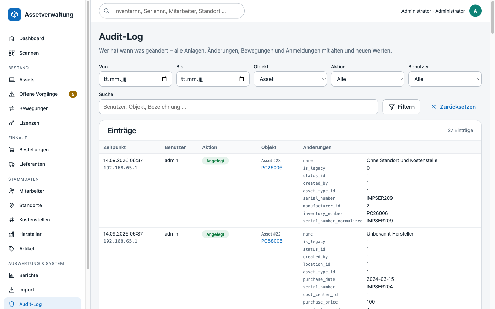
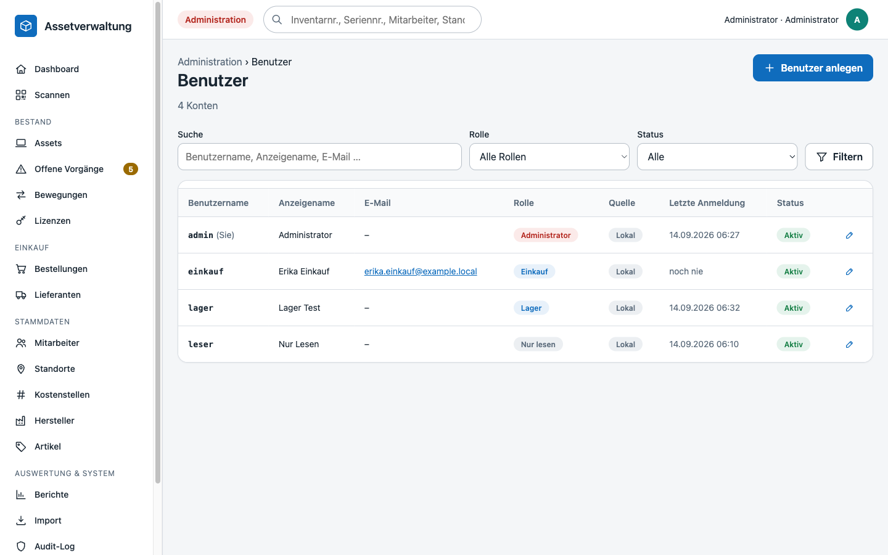
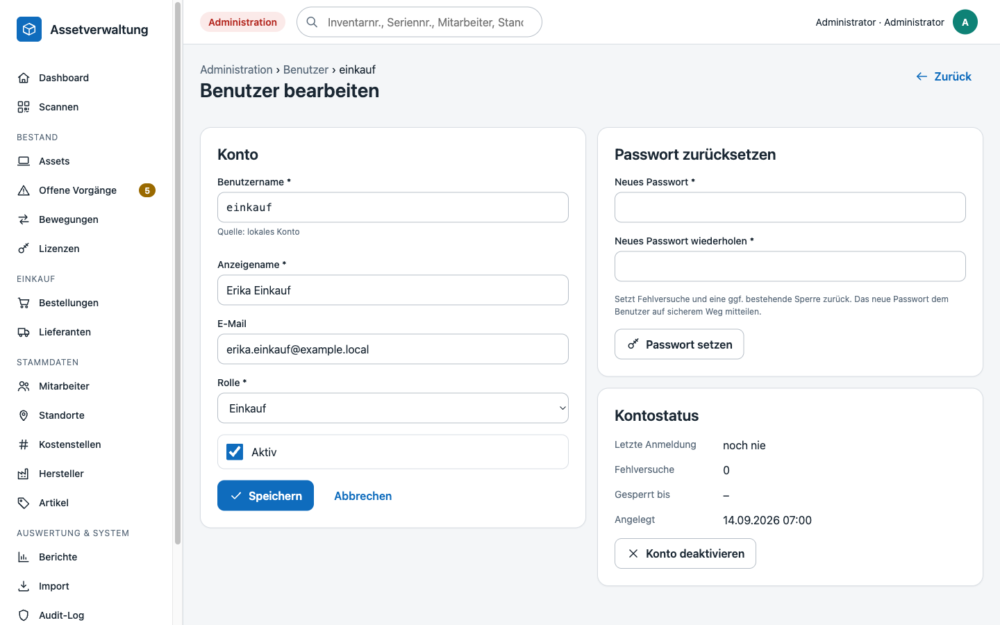
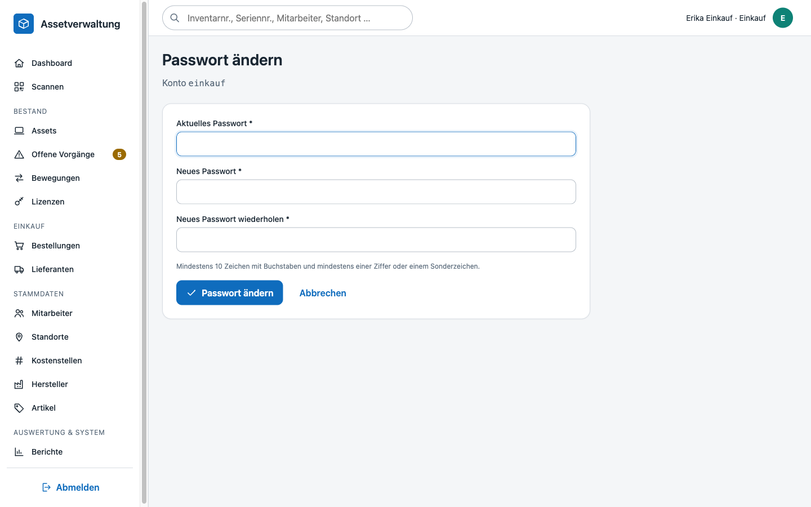

# Audit-Log & Benutzerverwaltung

## Audit-Log

Jede schreibende Aktion – fachlich (Asset angelegt, Entnahme, Wareneingang, Lizenz zugeordnet …) wie administrativ (Anmeldung, Benutzer angelegt, Passwort zurückgesetzt, Einstellungen) – erzeugt einen Eintrag in `audit_logs` mit Benutzer, Zeitpunkt, IP-Adresse, Aktion, betroffenem Objekt und den **geänderten Feldern** als Vorher/Nachher-Werten. Einträge werden nur angehängt, nie verändert oder gelöscht. Passwörter, Passwort-Hashes, Session- und CSRF-Tokens gelangen nie in das Audit-Log oder in die Anwendungslogs.

### Ansicht `/audit`

Erreichbar über *Administration → Audit-Log* für Benutzer mit dem Recht `audit.view` (Rollen *Administrator* und *Assetmanagement*).

Filter:

| Filter | Wirkung |
|---|---|
| Suche | Objektbezeichnung, Benutzername, Aktion und Objekttyp |
| Objekttyp / Objekt-ID | z. B. alle Einträge zu Asset 42 – die Detailansichten von Assets, Bewegungen, Bestellungen, Lizenzen usw. verlinken direkt hierher |
| Aktion | Angelegt, Geändert, Statuswechsel, Entnahme, Retoure, Storniert, Wareneingang, Zugeordnet, Freigegeben, Dokument hochgeladen, Gedruckt, Import, Anmeldung, Abmeldung, Anmeldung fehlgeschlagen, AD-Sync, Ausgemustert, Zusammengeführt, Passwort zurückgesetzt, Passwort geändert … |
| Benutzer | Anmeldename des Verursachers (bei fehlgeschlagenen Anmeldungen der eingegebene Name) |
| Zeitraum | Von/Bis (lokale Zeitzone; intern UTC) |

Die Auswahlfelder zeigen nur tatsächlich vorkommende Werte. Jeder Eintrag zeigt die geänderten Felder als Tabelle *Feld · alt · neu*; Objekte mit eigener Detailseite sind verlinkt. Die Liste ist paginiert und über die Indizes auf Zeit, Objekt, Benutzer und Aktion auch bei vielen hunderttausend Einträgen schnell.

### Abgrenzung zur Asset-Historie

Die **Asset-Historie** (Detailansicht eines Assets) ist die fachliche Sicht: feldgenaue Änderungen, Bewegungen, Etikettendrucke und Statuswechsel eines einzelnen Gegenstands, verständlich für alle Benutzer. Das **Audit-Log** ist die revisionssichere Gesamtsicht über alle Objekte inklusive Anmeldevorgängen und Verwaltungsaktionen und nur für Administratoren und das Assetmanagement sichtbar.

## Benutzerverwaltung

*Administration → Benutzer* (`/admin/users`, Recht `users.manage`, nur Rolle *Administrator*).

Die Liste zeigt alle Konten mit Rolle, Quelle (lokal / Active Directory), Status, letzter Anmeldung und – falls ein Konto nach zu vielen Fehlversuchen gesperrt ist – die Sperre. Suche über Anmeldename, Anzeigename und E-Mail; Filter nach Rolle und Status.

### Rollen

| Rolle | Rechte |
|---|---|
| Administrator | alles, einschließlich Benutzerverwaltung und Einstellungen |
| Assetmanagement | Assets, Bewegungen, Stammdaten, Mitarbeiter/AD-Sync, Dokumente, Lizenzen, Etiketten, Import, Reporting-Export, Audit-Log |
| Lager | Lesen, Entnahme/Retoure/Nacherfassung, Wareneingang, Assets pflegen, Etiketten, Dokumente |
| Einkauf | Lesen, Lieferanten, Bestellungen, Wareneingang, Hersteller/Artikel, Lizenzen, Dokumente, Reporting-Export |
| Nur lesen | alle Ansichten außer Audit-Log |

Die Rechtezuordnung liegt in `config/permissions.php` und wird bei **jeder Anfrage** neu aus dem Benutzerkonto gelesen: Eine Rollenänderung oder Deaktivierung wirkt sofort, auch in bereits angemeldeten Sitzungen (deaktivierte Benutzer werden bei der nächsten Anfrage abgemeldet).

### Konto anlegen und bearbeiten

- **Anmeldename**: 3–64 Zeichen aus Buchstaben, Ziffern sowie `. _ - @`, beginnend mit Buchstabe oder Ziffer; eindeutig; nachträglich nicht änderbar.
- **Anzeigename**, optionale **E-Mail**, **Rolle**, **Aktiv**.
- **Passwort** (nur lokale Konten): mindestens 10 Zeichen, mindestens ein Buchstabe und ein weiteres Zeichen (Ziffer oder Sonderzeichen). Es wird als Argon2id-Hash gespeichert.
- **AD-Konten** (`auth_source = ldap`) haben kein lokales Passwort; für sie können nur Rolle, Anzeigename, E-Mail und Aktiv-Status gepflegt werden. Anmeldung erfolgt gegen das Verzeichnis ([AD-Synchronisation](ad-sync.md)).

Schutzregeln, die die Anwendung erzwingt:

- Ein Administrator kann **sich selbst nicht deaktivieren** und **sich selbst nicht die Administrator-Rolle entziehen**.
- Der **letzte aktive Administrator** kann weder deaktiviert noch herabgestuft werden.
- Konten werden **deaktiviert, nicht gelöscht** – Audit-Log und Historie bleiben nachvollziehbar.

### Passwörter

- **Zurücksetzen** (Administrator): setzt ein neues Passwort, hebt eine bestehende Sperre auf und setzt den Fehlversuchszähler zurück. Wird als *Passwort zurückgesetzt* protokolliert – ohne das Passwort selbst.
- **Eigenes Passwort ändern**: über den eigenen Namen in der Kopfzeile (`/profile/password`). Das aktuelle Passwort muss bestätigt werden; die Änderung erscheint als *Passwort geändert* im Audit-Log.

### Anmeldesperre

Nach `login_max_attempts` (Standard 10) fehlgeschlagenen Anmeldungen wird das Konto für `login_lockout_minutes` (Standard 15) Minuten gesperrt (`config/app.php`). Jeder Fehlversuch wird als *Anmeldung fehlgeschlagen* protokolliert. Die Sperre wird in der Datenbank in UTC geführt und dort auch ausgewertet, sodass sie unabhängig von der Zeitzone der Anwendung korrekt greift. Ein Administrator kann eine Sperre über *Passwort zurücksetzen* vorzeitig aufheben.
