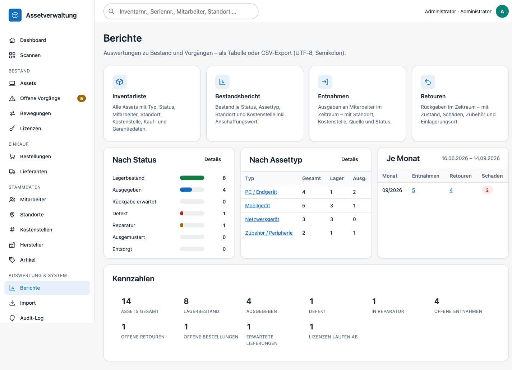
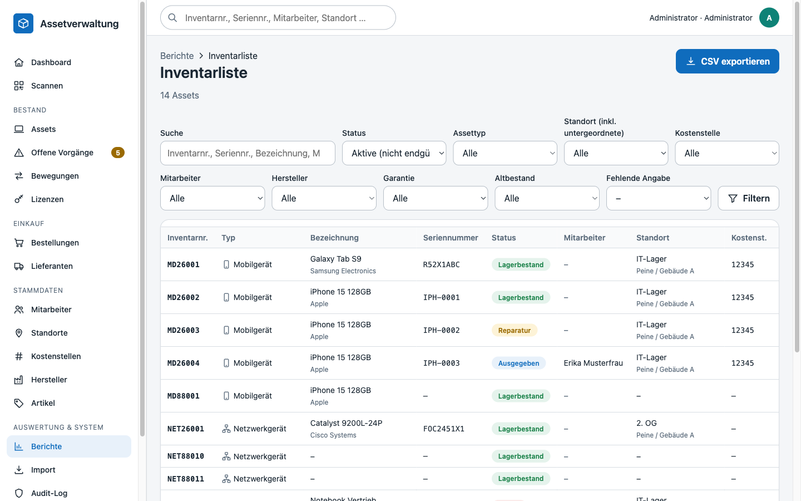
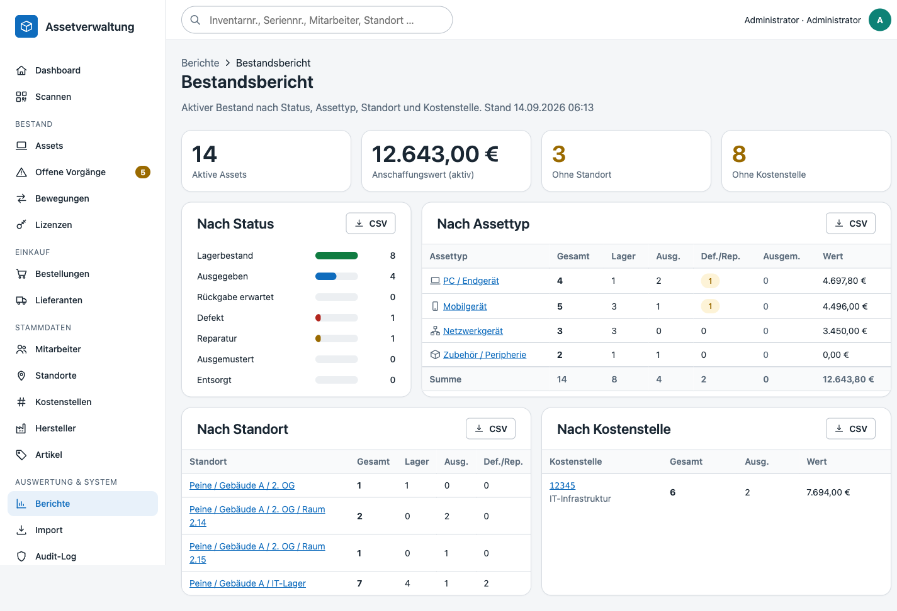
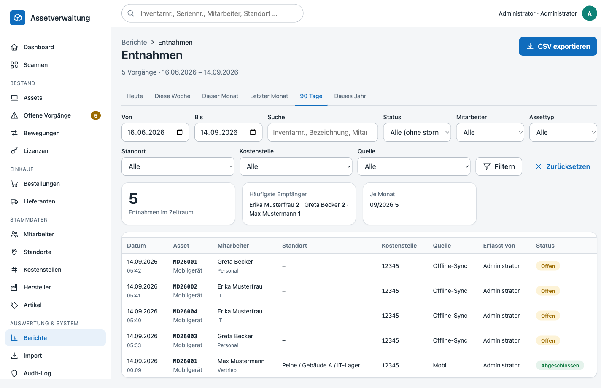
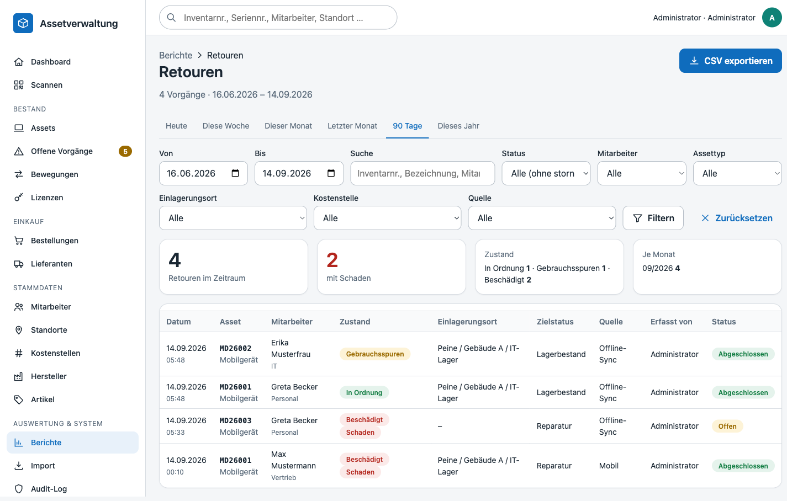

# Berichte & Dashboard – Auswertungen und CSV-Export

Das **Dashboard** (`/dashboard`) zeigt auf einen Blick, was zu tun ist; die **Berichte** (`/reports`) liefern Inventarliste, Bestandsbericht sowie Entnahmen- und Retourenauswertungen – jeweils als filterbare Tabelle und als CSV-Export.

## Dashboard

### Offene Aufgaben

Die Karte *Offene Aufgaben* steht oben und listet nur, was aktuell eine Handlung erfordert (Einträge mit Zähler 0 werden ausgeblendet; angezeigt wird nur, was die Rolle sehen darf):

| Aufgabe | Bedingung | Ziel | Stufe |
|---|---|---|---|
| Überfällige Rückgaben | `expected_return_at` überschritten, Asset noch ausgegeben | `/assets?overdue=1` | rot |
| Offene Entnahmen | Entnahmen mit Status `open` (Standort/Kostenstelle fehlen) | `/movements/open?type=checkout` | gelb |
| Offene Retouren | Retouren mit Status `open` | `/movements/open?type=return` | gelb |
| Defekte Assets | Status `defective` | `/assets?status=defective` | rot |
| Assets in Reparatur | Status `repair` | `/assets?status=repair` | gelb |
| Überfällige Lieferungen | Bestellung `ordered`/`partially_delivered`, Liefertermin überschritten | `/orders?status=overdue` | rot |
| Erwartete Lieferungen (14 Tage) | Liefertermin innerhalb von 14 Tagen | `/orders?status=open` | blau |
| Lizenzen laufen ab (60 Tage) | Ablaufdatum innerhalb von 60 Tagen | `/licenses?expiring=60` | gelb |

### Meine Einkaufsaufgaben

Für Benutzer mit `orders.view` erscheint darunter die persönliche Karte *Meine Einkaufsaufgaben* – ausgeblendet, solange nichts offen ist:

| Aufgabe | Bedingung | Ziel | Stufe |
|---|---|---|---|
| Bestellentwurf vervollständigen | eigene Bestellung im Status `draft` (die 5 zuletzt geänderten) | `/orders/{id}` | gelb |
| Bedarfsmeldung ist noch offen | eigene Bedarfsmeldung im Status `open` (die 5 jüngsten) | `/orders/requests` | blau |

### Kennzahlen

Assets gesamt, im Lager, ausgegeben, defekt, in Reparatur, offene Entnahmen, offene Retouren, Rückgabe überfällig, Bewegungen heute, offene Bestellungen, erwartete Lieferungen (mit Anzahl überfälliger), ablaufende Lizenzen. Jede Karte verlinkt auf die passend gefilterte Liste.

Darunter: Schnellzugriff (Scannen, Entnahme, Retoure, Asset anlegen), letzte Bewegungen, anstehende Rückgaben, erwartete Lieferungen und die letzten Änderungen an Assets (aus der Historie).

## Berichte (`/reports`)

Die Übersicht zeigt die vier Berichte, den Bestand nach Status (Balken) und Assettyp, Bewegungen je Monat der letzten 90 Tage (verlinkt auf die Monatsauswertung) und die Kennzahlen des Dashboards.

| Bericht | Route | Inhalt |
|---|---|---|
| Inventarliste | `/reports/inventory` | alle Assets mit Typ, Status, Mitarbeiter, Standort, Kostenstelle, Kauf- und Garantiedaten |
| Bestandsbericht | `/reports/stock` | Bestand nach Status, Assettyp, Standort und Kostenstelle inkl. Anschaffungswert; Assets ohne Standort/Kostenstelle |
| Entnahmen | `/reports/checkouts` | Ausgaben an Mitarbeiter im Zeitraum |
| Retouren | `/reports/returns` | Rückgaben im Zeitraum mit Zustand, Schäden, Zubehör, Einlagerungsort |

Berechtigungen: `reports.view` (alle Rollen) zum Ansehen, `reports.export` (Admin, Assetmanagement, Einkauf) für den CSV-Download. Ohne Exportrecht wird die Schaltfläche ausgeblendet und `?format=csv` mit *403* beantwortet.

### Inventarliste

Filter: Volltext (Inventarnummer, Seriennummer, Bezeichnung, MAC, IMEI, Mitarbeiter), Status (*Aktive* = nicht endgültig ausgemustert – Standard, *Nicht zugeordnet*, *Ausgemustert/Entsorgt*, *Alle* oder ein konkreter Status), Assettyp, Standort (inklusive untergeordneter Standorte), Kostenstelle, Mitarbeiter, Hersteller, Garantie (abgelaufen / läuft in 90 Tagen ab / gültig / ohne), Altbestand und **Fehlende Angabe** (ohne Standort, Kostenstelle, Seriennummer, Kaufdatum oder Kaufpreis). Sortierbar nach Inventarnummer, Typ, Bezeichnung, Status, Mitarbeiter, Standort, Kaufdatum, Garantie. Ein Klick auf eine Zeile öffnet das Asset.

Der CSV-Export übernimmt die aktuellen Filter (ohne Seitenbegrenzung, maximal 50 000 Zeilen) und enthält 27 Spalten: Inventarnummer, Bezeichnung, Assettyp, Kategorie, Hersteller, Artikel, Seriennummer, MAC-Adresse, IMEI, Status, Mitarbeiter, Benutzername, Abteilung, Standort, Kostenstelle, Kostenstelle Bezeichnung, Kaufdatum, Kaufpreis, Garantie bis, Lieferant, Bestellung, Rückgabe erwartet, Übergeordnetes Asset, Altbestand, Bemerkung, Angelegt am, Geändert am.

### Bestandsbericht

Vier Kennzahlen (aktive Assets, Anschaffungswert, ohne Standort, ohne Kostenstelle – die letzten beiden verlinken auf die entsprechend gefilterte Inventarliste) und vier Abschnitte, jeweils mit eigenem CSV-Export (`?format=csv&section=status|type|location|cost_center`):

- **Nach Status** – alle Statuswerte mit Balken.
- **Nach Assettyp** – gesamt, Lager, ausgegeben, defekt/in Reparatur, ausgemustert/entsorgt, Anschaffungswert des aktiven Bestands, Summenzeile.
- **Nach Standort** – nur Standorte mit aktivem Bestand, direkte Zuordnung (keine Aggregation über den Baum).
- **Nach Kostenstelle** – gesamt, ausgegeben, Anschaffungswert.

Ausgemusterte und entsorgte Assets zählen in den Summen nach Typ, Standort und Kostenstelle **nicht** mit (nur die Spalte *Ausgem.*).

### Entnahmen und Retouren

Zeitraum (Standard: letzte 90 Tage; Schnellwahl Heute, diese Woche, dieser Monat, letzter Monat, 90 Tage, dieses Jahr), Volltext, Status (*Alle ohne stornierte* – Standard, *Alle inkl. stornierte*, offen, abgeschlossen, storniert), Mitarbeiter, Assettyp, Standort bzw. Einlagerungsort, Kostenstelle und Quelle (Desktop, Mobil, Offline-Sync, Import).

Kennzahlen oberhalb der Tabelle: Anzahl im Zeitraum, je Monat, bei Entnahmen die häufigsten Empfänger, bei Retouren Anzahl mit Schaden und Verteilung nach Zustand. Stornierte Vorgänge fließen in die Kennzahlen nicht ein. Ein Klick auf die Zeile öffnet die Bewegung.

CSV-Spalten (beide): Datum, Uhrzeit, Typ, Status, Inventarnummer, Bezeichnung, Assettyp, Seriennummer, Mitarbeiter, Benutzername, Abteilung, Kostenstelle, Standort/Einlagerungsort, Quelle, Erfasst von, Bemerkung. Entnahmen zusätzlich: Von Standort, Fehlende Angaben. Retouren zusätzlich: Zustand, Schaden, Schadensbeschreibung, Zubehör geprüft, Zubehör-Hinweis, Zielstatus, Dokumente (Anzahl Fotos).

## CSV-Format

Alle Exporte erzeugt `App\Support\CsvWriter`:

- UTF-8 **mit BOM**, Trennzeichen **Semikolon**, Zeilenende CRLF – Excel im deutschen Sprachraum öffnet die Datei ohne Importassistent korrekt.
- Datum `TT.MM.JJJJ`, Zeitstempel `TT.MM.JJJJ HH:MM` in der konfigurierten Zeitzone (`APP_TIMEZONE`), Beträge mit Komma und zwei Nachkommastellen, Ja/Nein für Wahrheitswerte.
- Zellen mit Trennzeichen, Anführungszeichen oder Zeilenumbrüchen werden in Anführungszeichen gesetzt (`"` → `""`).
- **Schutz vor Formel-Injektion:** Werte, die mit `=`, `+`, `-`, `@`, Tab oder CR beginnen und keine Zahl sind, erhalten ein führendes `'` (z. B. Seriennummer `=CMD()` → `'=CMD()`).
- Dateiname `<bericht>-JJJJ-MM-TT.csv`, `Content-Type: text/csv; charset=UTF-8`, `Content-Disposition: attachment`.
- Obergrenze 50 000 Zeilen pro Export.

## Technik

| Baustein | Aufgabe |
|---|---|
| `ReportController` | Routen `/reports`, `/reports/inventory`, `/reports/stock`, `/reports/checkouts`, `/reports/returns`; `?format=csv` liefert den Download |
| `ReportService` | Filternormalisierung (Zeitraum, Status), Inventarliste über `AssetRepository::search`, Bewegungen über `MovementRepository::search`, CSV-Aufbau, Rechteprüfung `reports.export` |
| `ReportRepository` | Aggregationen: Bestand nach Status/Typ/Standort/Kostenstelle, fehlende Zuordnungen, Bewegungen je Monat, Zustandsverteilung, Empfänger, erwartete Lieferungen |
| `DashboardService` | Kennzahlen, `openTasks()` (nur Zähler > 0 und mit Berechtigung), erwartete Lieferungen |
| `CsvWriter` | CSV-Erzeugung mit BOM, Quoting und Formelschutz |

Tests: `tests/Unit/CsvWriterTest.php` (Format, Quoting, Formelschutz, Dateiname) und `tests/Integration/ReportServiceIntegrationTest.php` (Standortbaum-Filter, Statusvorgabe, fehlende Angaben, CSV-Inhalte, Berechtigungen, Bestandsaggregate, Zeitraumnormalisierung, Entnahme-/Retouren-CSV, Dashboard-Aufgaben).
