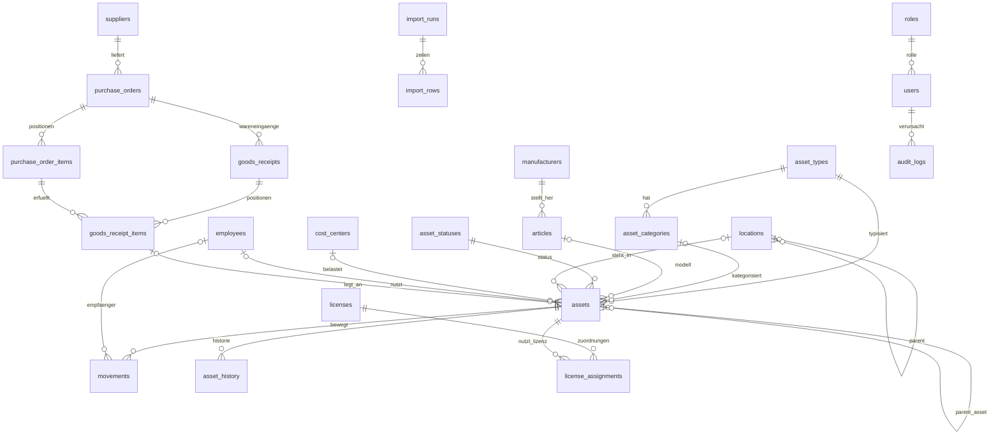

# Datenmodell

MySQL 8.4, `utf8mb4_unicode_ci`, InnoDB mit Fremdschlüsseln. Alle Zeitstempel (`created_at`, `updated_at`, `*_at`) liegen in **UTC** (die Datenbanksitzung wird auf `+00:00` gestellt) und werden erst bei der Anzeige in `APP_TIMEZONE` umgerechnet; reine Datumsfelder (`purchase_date`, `movement_date`, `expires_at` …) sind zeitzonenfrei. Schema und Änderungen liegen als nummerierte SQL-Dateien in `database/migrations/` und werden über `schema_migrations` genau einmal angewendet.

## Kernobjekte

### `assets` – Inventargegenstände

| Spalte | Bedeutung |
|---|---|
| `inventory_number` | Eindeutig, Format `<PREFIX><JJ><NNN>` (z. B. `PC26001`), Altbestand mit Jahreskennung `88`; Vergabe über `inventory_sequences` ([Assets](assets.md)) |
| `asset_type_id`, `asset_category_id` | Typ (PC, MD, NET, ZUB) und optionale Kategorie innerhalb des Typs |
| `manufacturer_id`, `article_id`, `name` | Hersteller, Artikel/Modell, Freitextbezeichnung |
| `serial_number`, `serial_number_normalized` | Seriennummer; normalisiert (Großschreibung, ohne Trennzeichen) und **eindeutig je Assettyp** (`uq_assets_type_serial`) |
| `mac_address`, `imei` | Nur für Typen mit entsprechendem Flag (`asset_types.has_mac_address/has_imei`) |
| `purchase_date`, `purchase_price`, `warranty_until`, `supplier_id`, `purchase_order_id`, `purchase_order_item_id`, `goods_receipt_id` | Beschaffung; Verknüpfung zur Bestellung, aus deren Wareneingang das Asset entstand |
| `location_id`, `cost_center_id`, `employee_id`, `expected_return_at` | Aktuelle Zuordnung (Standort, Kostenstelle, Mitarbeiter, erwartete Rückgabe) |
| `status_id` | Verweis auf `asset_statuses` (`in_stock`, `issued`, `return_expected`, `defective`, `repair`, `retired`, `disposed`; `is_available` = entnehmbar, `is_final` = endgültig) |
| `parent_asset_id` | Zubehör kann einem Hauptgerät untergeordnet sein |
| `is_legacy`, `version`, `created_by` | Altbestand-Kennzeichen; Versionszähler für optimistische Sperre |

**`asset_history`** protokolliert jede fachliche Änderung am Asset feldgenau (`event_type`, `field`, `old_value`/`new_value`, `old_id`/`new_id`, `movement_id`, `actor_name`, `note`) und ist Grundlage der Asset-Historie in der Detailansicht.

### `movements` – Entnahmen und Retouren

`type` (`checkout`/`return`), `status` (`completed`, `open` = unvollständig erfasst, `cancelled`), `asset_id`, `employee_id`, `from_location_id`/`to_location_id`, `cost_center_id`, `movement_date`/`movement_at`, Zustand (`condition_code` `ok|worn|damaged|defective`, `has_damage`, `damage_description`), Zubehörprüfung, `target_status_code`, `missing_fields` (JSON – offene Pflichtangaben), `source` (`web|mobile|offline_sync|import`), `client_transaction_id` (UUID vom Client, eindeutig – Idempotenz), Ersteller/Abschließer. Details: [Bestandsmanagement](movements.md).

**`sync_transactions`** speichert je Offline-Transaktion Payload, Ergebnis (`applied|conflict|rejected`) und ggf. das erzeugte Movement, damit wiederholte Übertragungen dasselbe Ergebnis liefern ([Offline](offline.md)).

### Stammdaten

| Tabelle | Wesentliche Spalten |
|---|---|
| `asset_types` | `code`, `name`, `inventory_prefix`, Flags `has_serial_number/has_mac_address/has_imei/supports_licenses`, `icon`, `sort_order` |
| `asset_categories` | je Typ: `name`, `sort_order` |
| `asset_statuses` | `code`, `name`, `color`, `is_available`, `is_final` |
| `manufacturers` | `name` (eindeutig), `short_name`, `website`, `contact`, `phonetic_key` (Kölner Phonetik) und `normalized_name` für die Dublettenwarnung |
| `articles` | `manufacturer_id`, `asset_type_id`, `asset_category_id`, `name`, `article_number`, `normalized_name`/`phonetic_key` (Dublettenwarnung), `is_handover_relevant` (Asset erscheint im Übergabeprotokoll), `is_consumable` mit `minimum_stock`/`stock_quantity` (Verbrauchsmaterial ohne Assets, Grundlage der Bestellvorschläge) |
| `suppliers` | Firma, Anschrift, Kontakt, `customer_number` |
| `locations` | Baum über `parent_id`; `type` (`site|building|floor|room|workplace|warehouse|other`), `code`, materialisierter `full_path` und `depth` für schnelle Anzeige/Suche |
| `cost_centers` | `number` (eindeutig), `description`, optional `location_id` |
| `employees` | `ad_object_guid` (eindeutig, stabile AD-ID), `username`, Name, `email`, `personnel_number`, `department`, `position`, `phone`, AD-Rohwerte `ad_location`/`ad_cost_center` und aufgelöste `location_id`/`cost_center_id`, `source` (`ad|manual`), `is_active`, `deactivated_at`, `last_synced_at` |
| `ad_sync_runs` | Protokoll je Synchronisationslauf: Zähler, Status, `triggered_by`, `details` (JSON) |

Alle Stammdaten werden **deaktiviert statt gelöscht** (`is_active`), damit Historie und Referenzen erhalten bleiben.

### Einkauf

`purchase_orders` (`order_number` eindeutig, `supplier_id`, `status` `draft → ordered → partially_delivered → delivered → closed`, alternativ `cancelled`, `expected_delivery_date`, `cost_center_id`) mit `purchase_order_items` (`position`, `article_id`/`asset_type_id`, `description`, `quantity`, `quantity_received`, `unit_price`, `creates_assets`). `goods_receipts` (Lieferung: `received_at`, `delivery_note_number`, `location_id`) mit `goods_receipt_items`, die je Position die gelieferte Menge festhalten und bei `creates_assets` pro Stück ein Asset anlegen (`asset_id`, `serial_number`) – bei Verbrauchsartikeln stattdessen `articles.stock_quantity` erhöhen.

`purchase_order_templates` (`name`, `supplier_id`, `cost_center_id`, `note`, `created_by`) mit `purchase_order_template_items` (`position` je Vorlage eindeutig, `article_id`/`asset_type_id`, `description`, `quantity`, `unit_price`, `creates_assets`, `note`) speichern wiederverwendbare Bestellungen. `purchase_requests` (`requested_by`/`requested_by_name`, `cost_center_id`, `status` `open → converted`, alternativ `cancelled`, `note`, `purchase_order_id` der erzeugten Bestellung) mit `purchase_request_items` (`article_id`, `description`, `quantity`, `note`) halten die Bedarfsmeldungen. Details: [Einkauf](einkauf.md).

### Lizenzen

`licenses` (Hersteller, `product`, `license_type`, `license_key`, `license_number`, `quantity`, Laufzeit `expires_at`, Kosten, Kostenstelle, Bezug zu Lieferant/Bestellung) und `license_assignments` (Zuordnung zu Assets mit `assigned_at`/`released_at`; aktive Zuordnungen zählen gegen `quantity`). Details: [Lizenzen](lizenzen.md).

### Dokumente

`documents`: polymorph über `entity_type` (`asset|purchase_order|license|movement|supplier|import|handover`) und `entity_id`; `document_type` (`order|order_confirmation|delivery_note|invoice|license|photo|signature|handover_protocol|other`), `original_name`, `stored_name` (UUID-basiert, eindeutig), `mime_type`, `size_bytes`, `sha256`, Hochladender. Die Dateien liegen unter `storage/uploads/JJJJ/MM/` außerhalb des Webroots.

### Übergabeprotokolle

- `handover_templates`: Vorlage des Baukastens – `name`, `blocks` (JSON-Liste der Blöcke), `is_default`, `updated_by`.
- `handover_protocols`: je Mitarbeiter fortlaufend versioniert (`employee_id` + `version` eindeutig). `protocol_number` (eindeutig, `UP-<Personalnr.>-<Version>`), `status` (`draft → signed → superseded`, alternativ `cancelled`), eingefrorene Snapshots `template_snapshot`, `employee_snapshot`, `items` (JSON) und `rendered_html`, `item_count`, `asset_fingerprint` (SHA-256 der sortierten Asset-IDs zum Erkennen von Bestandsänderungen), Signaturdaten `signed_at`/`signed_device`/`signed_ip`, Verweise `signature_document_id` (PNG) und `pdf_document_id` (archiviertes PDF), `issuer_*`, `cancelled_at`/`cancel_reason`. Das zuletzt unterschriebene Protokoll gilt; ältere werden beim Unterschreiben der Folgeversion auf `superseded` gesetzt. Details: [Übergabeprotokoll](uebergabeprotokoll.md).

### Import

`import_runs` (Datei, erkannte `delimiter`/`encoding`, `options` und `columns_found` als JSON, Zähler je Status, `status` `preview|completed|cancelled|failed`) und `import_rows` (`line_no`, `status` `valid|warning|error|duplicate|imported|skipped`, `summary`, `messages` JSON, `data` JSON, ggf. `asset_id`). Details: [Import](import.md).

### Benutzer, Rechte, Audit

- `roles` (`name`, `label`) – die Rechte je Rolle liegen bewusst im Code (`config/permissions.php`), nicht in der Datenbank.
- `users`: `username` (eindeutig), `display_name`, `email`, `password_hash` (Argon2id, `NULL` bei AD-Konten), `role_id`, `auth_source` (`local|ldap`), optional `employee_id`, `is_active`, `failed_logins`, `locked_until`, `last_login_at`.
- `audit_logs`: `user_id`, `username`, `action`, `object_type`, `object_id`, `object_label`, `old_data`/`new_data` (JSON, nur geänderte Felder), `ip_address`, `created_at`. Indizes auf Objekt, Benutzer, Aktion und Zeit. Details: [Audit-Log & Benutzer](audit.md).
- `system_settings`: Schlüssel/Wert (Etikettenlayout u. a.), `updated_by`.
- `inventory_sequences`: `prefix`, `year_code`, `last_number` – Vergabe unter `SELECT … FOR UPDATE`.

### Help Desk

- Stammdaten: `ticket_types` (Störung, Anfrage, Änderung, Problem), `ticket_statuses` (`category` `new|open|pending|resolved|closed|cancelled`, `allowed_transitions` JSON, Farbe, Reihenfolge), `ticket_priorities` (Level, Farbe), `ticket_categories` (zweistufig über `parent_id`, Standardgruppe/-SLA), `ticket_slas` (Reaktions-/Lösungsminuten, Servicezeiten, Warn-/Eskalationsprozent, optional je Priorität/Typ/Kategorie), `ticket_groups` + `ticket_group_members` (Agenten, Leitung), `ticket_tags`, `ticket_templates`, `ticket_rules` (`trigger_event`, Bedingungen/Aktionen JSON, `sort_order`, `stop_processing`), `ticket_sequences` (Nummernkreis je Jahr).
- `tickets`: `number` (eindeutig, `PREFIX-JJJJ-NNNNNN`), `subject`, `description`, Typ/Kategorie/Unterkategorie, Status, Priorität, `impact`/`urgency`, SLA mit `response_due_at`/`resolution_due_at`, Pausen (`sla_paused_at`, `sla_paused_minutes`) und Zuständen `sla_response_state`/`sla_resolution_state`, Melder (`requester_employee_id`/`requester_user_id`), `affected_employee_id`, `assignee_user_id`, `deputy_user_id`, `group_id`, Standort/Kostenstelle, `source` (`web|portal|api|email|phone|scheduler`), Zeitstempel `first_response_at`/`resolved_at`/`closed_at`/`cancelled_at`, `escalation_level`, `reopen_count`, `resolution`, `close_reason`, `merged_into_ticket_id`, `knowledge_article_id`, `version` (optimistische Sperre). Indizes auf Status, Zuständigkeit, Gruppe, Melder, Fälligkeiten und Zeitstempel; Volltextindex auf Betreff/Beschreibung.
- Detailzeilen (`ON DELETE CASCADE` am Ticket): `ticket_comments` (`type` `public|internal`, `source`, Autor), `ticket_attachments` (Verweis auf `documents`, `comment_id`, `is_internal`), `ticket_events` (Historie: `type`, `field`, `old_value`/`new_value`, `payload` JSON, Akteur), `ticket_assets`, `ticket_tag_relations`, `ticket_relations` (`related|duplicate_of|parent_of|problem_of|change_for`), `ticket_watchers`, `ticket_worklogs` (`minutes`, `activity`, `started_at`), `ticket_notifications` (Ausgangsprotokoll mit `event_key`, `recipient`, `status`, `error`).
- Wissensdatenbank: `knowledge_articles` (`slug`, Titel, `summary`, `body`, Kategorie, `visibility` `internal|public`, `status` `draft|published|archived`, `view_count`, Autor), `knowledge_article_tags`, `knowledge_article_tickets`.

Details: [Help Desk](helpdesk.md).

## Konventionen

- Primärschlüssel `id INT UNSIGNED AUTO_INCREMENT`; Fremdschlüssel `<tabelle>_id`. Bestandsdaten werden nie kaskadiert gelöscht (`RESTRICT`); nur echte Detailzeilen hängen per `ON DELETE CASCADE` an ihrem Kopf (Bestell-/Wareneingangspositionen, Importzeilen, Asset-Historie, Lizenzzuordnungen).
- `created_at`/`updated_at` als `DATETIME` in UTC; `updated_at` wird von der Anwendung gesetzt.
- Suchrelevante Spalten sind indiziert (Inventar-/Seriennummer, MAC, IMEI, Namen, Status, Zuordnungen, Zeitstempel); Volltextsuche erfolgt über `LIKE` mit führenden Präfixen, wo möglich.
- Neue Migrationen: nächste freie Nummer `NNN_beschreibung.sql`, idempotent formulieren (`IF NOT EXISTS`, `DROP … IF EXISTS`), danach `php bin/migrate.php` – für die Test-Datenbank `--database=assets_test`.
