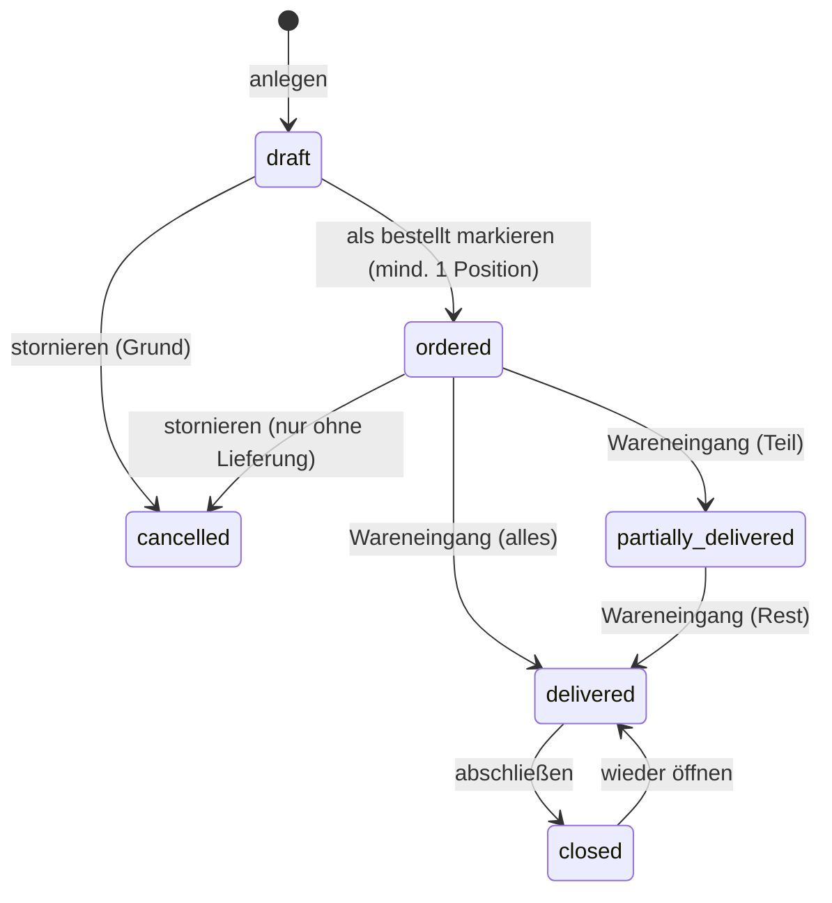
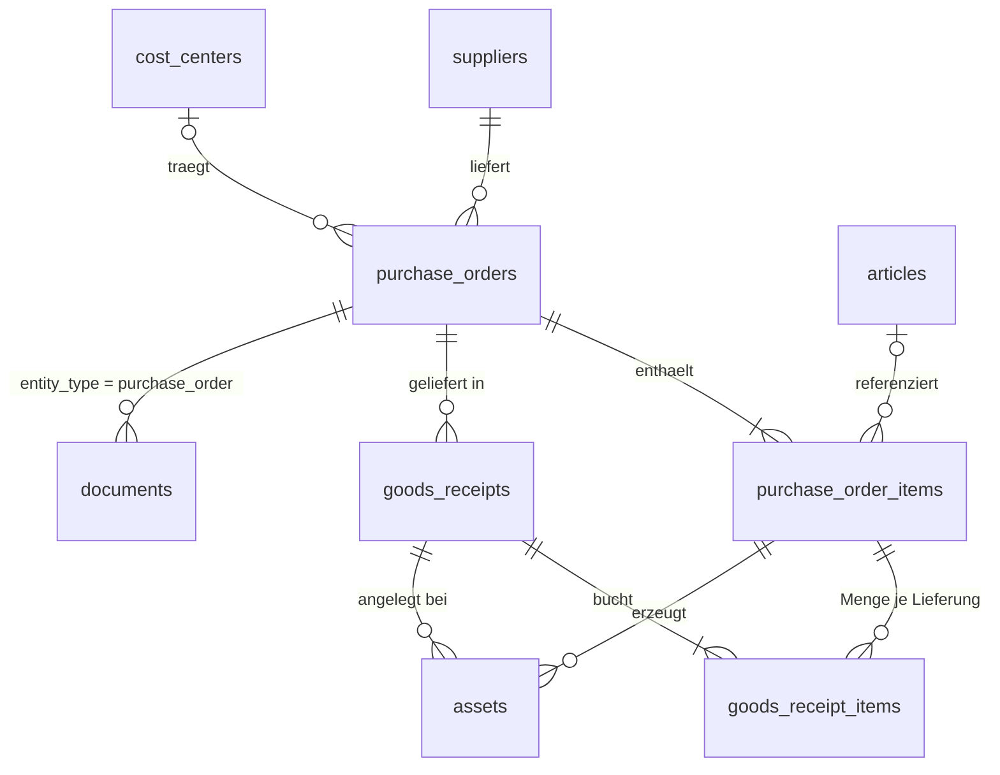

# Einkauf – Bestellungen & Wareneingang

Der Einkauf bildet den Weg von der Bestellung bis zum inventarisierten Gerät ab: Eine **Bestellung** (`purchase_orders`) fasst Positionen (`purchase_order_items`) bei einem Lieferanten zusammen. Beim **Wareneingang** (`goods_receipts`) werden gelieferte Mengen gebucht – auch in mehreren Teil-Lieferungen – und für jede gelieferte Einheit entsteht automatisch ein Asset mit Inventarnummer, Seriennummer, Einkaufsdaten und Lagerort. Die Assets sind dauerhaft mit Bestellung, Position und Lieferung verknüpft.


## Bestellungen (`/orders`)

Die Liste zeigt Bestellungen mit Lieferant, Bestell- und Lieferdatum, Besteller, Positionsanzahl, Lieferfortschritt (geliefert/gesamt als Balken) und Netto-Bestellwert. Statuskarteireiter mit Zählern filtern schnell:

| Reiter | Inhalt |
|---|---|
| **Offen** (Standard) | Status *Bestellt* und *Teilweise geliefert* – alles, worauf noch Ware erwartet wird |
| **Überfällig** | offene Bestellungen, deren erwartetes Lieferdatum überschritten ist |
| Entwürfe, Bestellt, Teilgeliefert, Geliefert, Abgeschlossen, Storniert | jeweils genau ein Status |
| **Alle** | ohne Statusfilter |

Zusätzlich lassen sich Volltext (Bestellnummer, Lieferant, Bemerkung, Positionstext), Lieferant, Kostenstelle und Bestelldatum-Zeitraum filtern. Das Dashboard verlinkt die Zahl der offenen Bestellungen, die Lieferantenseite alle Bestellungen des Lieferanten.

### Kopfdaten

| Feld | Bedeutung |
|---|---|
| Bestellnummer | automatisch `B-JJJJ-NNNN` (jahresweise fortlaufend) oder manuell, z. B. die Nummer aus dem ERP; eindeutig (Groß-/Kleinschreibung und Leerzeichen werden normalisiert) |
| Lieferant | Pflicht, nur aktive Lieferanten |
| Bestelldatum | wird beim Markieren als *bestellt* gesetzt, falls leer |
| Besteller | vorbelegt mit dem angemeldeten Benutzer; ein abweichender Freitextname ist möglich |
| Erwartetes Lieferdatum | steuert *Überfällig*; darf nicht vor dem Bestelldatum liegen |
| Kostenstelle | wird an die erzeugten Assets vererbt |
| Bemerkung | Freitext |

### Statusfluss



| Status | Anzeige | Positionen änderbar | Wareneingang möglich |
|---|---|---|---|
| `draft` | Entwurf | ja | nein |
| `ordered` | Bestellt | ja, bis zur ersten Lieferung | ja |
| `partially_delivered` | Teilweise geliefert | nein | ja |
| `delivered` | Vollständig geliefert | nein | nein |
| `closed` | Abgeschlossen (z. B. nach Rechnungsprüfung) | nein | nein |
| `cancelled` | Storniert | nein | nein |

Der Status *Teilweise geliefert* / *Vollständig geliefert* wird nach jedem Wareneingang aus den Positionsmengen berechnet. Stornieren ist nur möglich, solange nichts geliefert wurde; der Grund wird der Bemerkung angehängt und im Audit-Log protokolliert.

## Positionen


Positionen werden direkt auf der Bestellseite erfasst. Zwei Arten:

- **Artikelposition** – Auswahl aus dem Artikelstamm. Bezeichnung (`Hersteller Artikelname`) und Assettyp werden übernommen; die erzeugten Assets erhalten Artikel, Hersteller und Typ.
- **Freie Position** – beliebige Bezeichnung mit optionalem Assettyp. Ohne Haken *erzeugt Assets* (z. B. Versandkosten, Dienstleistungen) wird die Menge nur mitgezählt, es entstehen keine Assets.

Weitere Felder: Menge (1–10 000), Netto-Einzelpreis (deutsche oder englische Schreibweise), Bemerkung. Die Fußzeile summiert Menge, gelieferte Menge und Gesamtwert. Regeln:

- Positionen, die Assets erzeugen, benötigen einen Assettyp (direkt oder über den Artikel).
- Die Menge kann nicht unter die bereits gelieferte Menge gesenkt werden; Positionen mit Lieferungen lassen sich nicht löschen.
- Positionsnummern werden nicht wiederverwendet.

### Vorlagen, Bedarfe und Verbrauchsmaterial

- Bestehende Bestellungen lassen sich als **Bestellvorlage** speichern und erzeugen später mit einem Klick einen neuen Entwurf samt Positionen.
- Über **Bedarfsmeldungen** können Anwender Artikel oder freie Bedarfe mit Menge, Kostenstelle und Hinweis an den Einkauf übergeben. Der Einkauf übernimmt offene Meldungen mit einem ausgewählten Lieferanten in einen Bestellentwurf.
- Artikel können als **Verbrauchsmaterial** mit aktuellem Bestand und Mindestbestand markiert werden. Diese Artikel erzeugen niemals Assets oder Inventarnummern; beim Wareneingang erhöht sich ausschließlich ihr Lagerbestand.
- Liegt der Bestand auf oder unter dem Mindestbestand, erscheint der Artikel unter **Bestellvorschläge**. Dort wird ein Entwurf bis zum doppelten Mindestbestand erzeugt.

## Wareneingang


`Wareneingang buchen` ist ab Status *Bestellt* verfügbar. Kopf der Lieferung: Lieferdatum (nicht in der Zukunft), Lieferscheinnummer, Lagerort (vorbelegt mit dem ersten aktiven Lagerort vom Typ *Lager* bzw. mit „Lager“ im Namen) und Bemerkung.

Je Position wird die **gelieferte Menge** eingegeben (Schaltfläche *alle* setzt die offene Restmenge). Für Positionen, die Assets eines Typs mit Seriennummernpflicht erzeugen, erscheinen so viele Seriennummernfelder wie Stück eingegeben wurden; die Eingabetaste springt zum nächsten Feld, damit sich Seriennummern direkt vom Barcodescanner erfassen lassen. Doppelte Seriennummern innerhalb der Lieferung werden sofort markiert.

Beim Buchen passiert in **einer Transaktion**:

1. `goods_receipts` und je Position eine Zeile `goods_receipt_items` (Menge, Bemerkung) werden angelegt.
2. `purchase_order_items.quantity_received` wird erhöht; die Restmenge darf nicht überschritten werden.
3. Für jede gelieferte Einheit einer Asset-Position entsteht ein Asset über den regulären `AssetService` – mit neuer Inventarnummer, Assettyp, Artikel, Seriennummer, Lieferant, Kaufdatum (= Lieferdatum), Einkaufspreis (= Einzelpreis), Kostenstelle der Bestellung, Lagerort der Lieferung, Status *Lagerbestand* sowie den Verweisen `purchase_order_id`, `purchase_order_item_id`, `goods_receipt_id`. Die Asset-Historie erhält den Eintrag *Wareneingang*.
4. Der Bestellstatus wird neu berechnet und die Buchung im Audit-Log festgehalten.

Schlägt ein Schritt fehl – etwa weil eine Seriennummer im Assettyp bereits vergeben ist –, wird die gesamte Lieferung verworfen und der Fehler am betroffenen Feld angezeigt. Eingaben bleiben erhalten.


Nach dem Buchen zeigt die Lieferungsseite die gebuchten Positionen und die neu angelegten Assets; *Alle Etiketten drucken* öffnet die Etikettenvorschau (`/labels?ids=…`) für genau diese Assets. Die Bestellseite listet alle Lieferungen und alle aus der Bestellung erzeugten Assets, mit Link in die gefilterte Assetliste (`/assets?purchase_order_id=…`).

## Dokumente

Zur Bestellung können Bestellung, Auftragsbestätigung, Lieferschein, Rechnung usw. hochgeladen werden (PDF, Bilder, Office-Formate; Größe laut `UPLOAD_MAX_MB`). Dateien liegen außerhalb des Webroots und werden über `/documents/{id}` mit Berechtigungsprüfung ausgeliefert. Löschen entfernt Datei und Datensatz.

## Berechtigungen

| Recht | admin | einkauf | lager | assetmanagement | readonly |
|---|---|---|---|---|---|
| `orders.view` – Bestellungen sehen | ✓ | ✓ | ✓ | ✓ | ✓ |
| `orders.manage` – anlegen, ändern, Status, Positionen, stornieren | ✓ | ✓ | – | – | – |
| `orders.receive` – Wareneingang buchen | ✓ | ✓ | ✓ | – | – |
| `documents.manage` – Dokumente hochladen/löschen | ✓ | ✓ | ✓ | ✓ | – |

Der Wareneingang legt Assets ohne zusätzliche `assets.manage`-Prüfung an, damit die Rolle *Einkauf* Lieferungen buchen kann.

## Datenmodell



Migration `002_goods_receipt_items.sql` ergänzt `goods_receipt_items.note`, `goods_receipts.location_id` und `assets.goods_receipt_id`.

## Tests

`tests/Integration/PurchaseOrderServiceIntegrationTest.php` deckt ab: fortlaufende Bestellnummern, Validierung (doppelte Nummer, Lieferdatum vor Bestelldatum), Statusübergänge (bestellt nur mit Positionen, stornieren nur ohne Lieferung, abschließen/wieder öffnen), Positionsregeln (Typ aus Artikel, Assettyp-Pflicht, Sperre nach erster Lieferung), Teil- und Restlieferung mit Asset-Erzeugung, Historie und Verknüpfungen, Ablehnung von Übermengen, doppelten und bereits vergebenen Seriennummern inkl. Rollback sowie die Rollenrechte.

```bash
docker compose exec app php tests/run.php --integration --filter=PurchaseOrder
```
