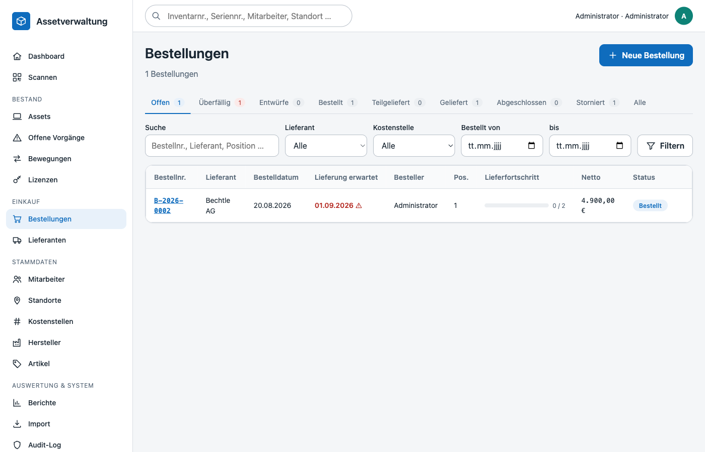
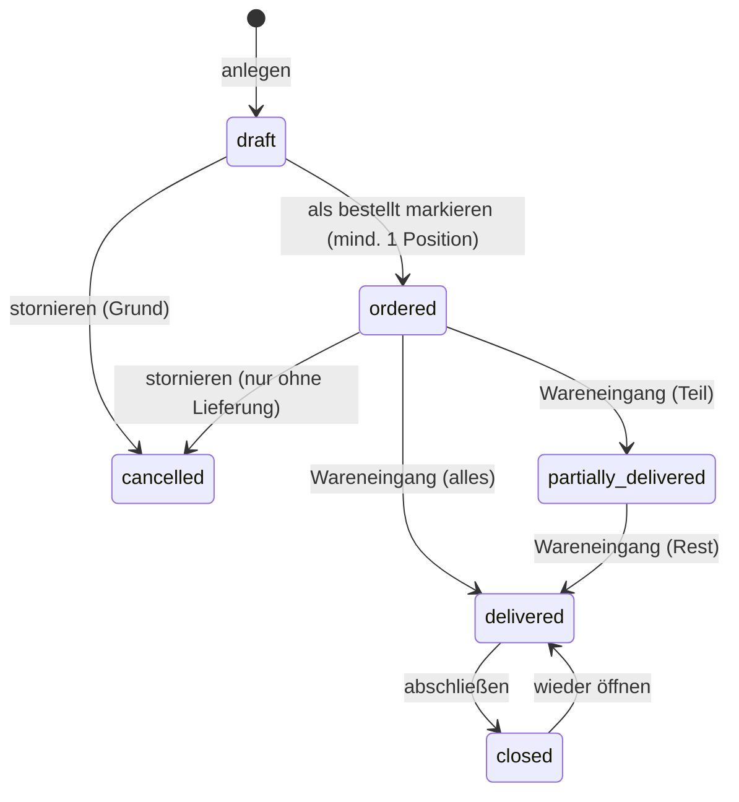
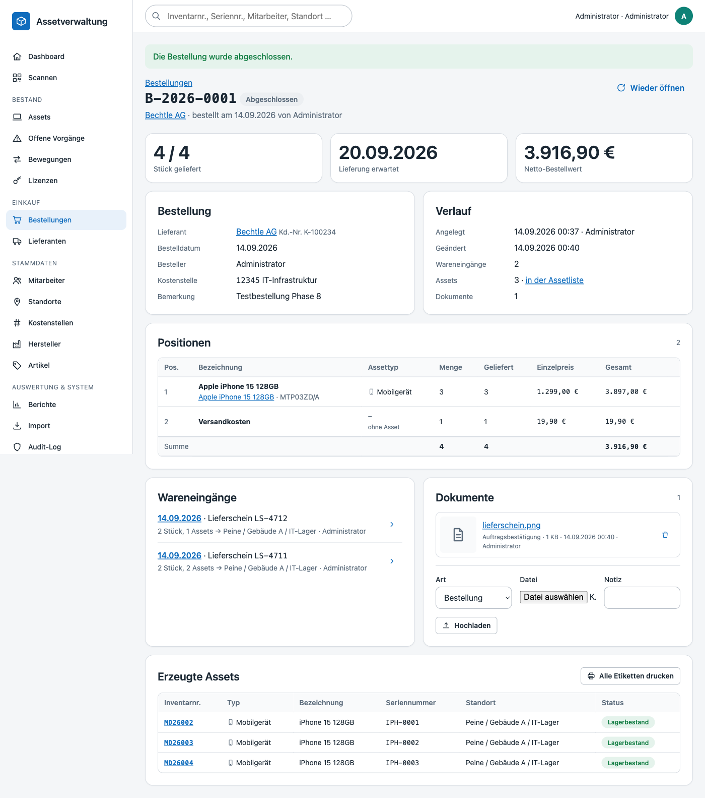
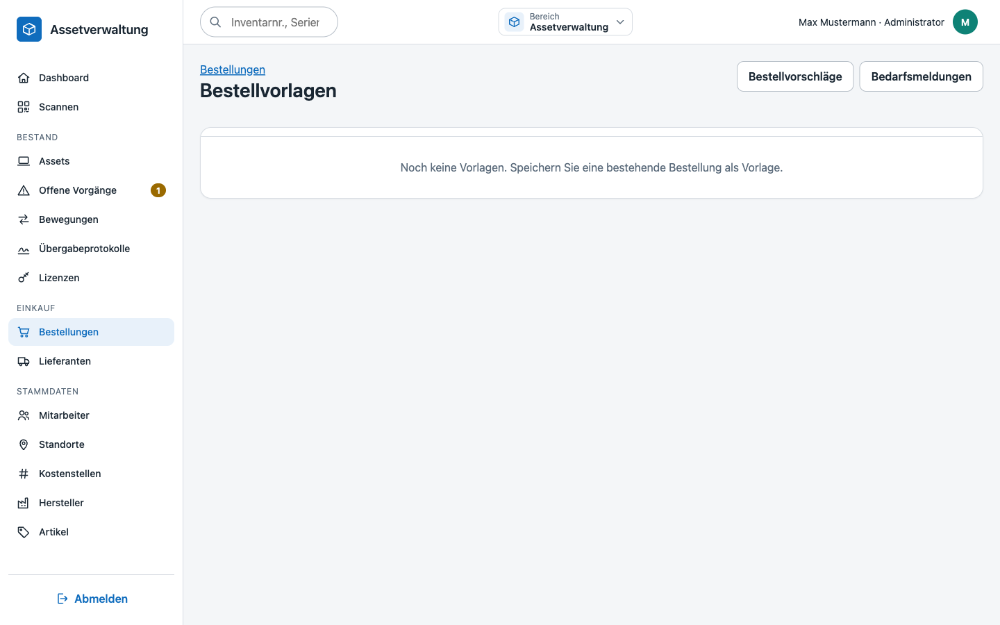
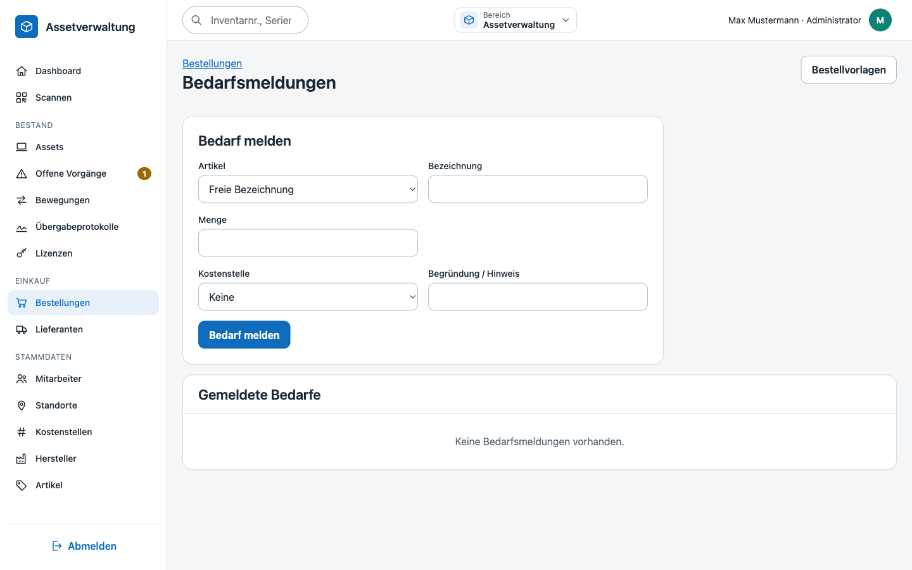
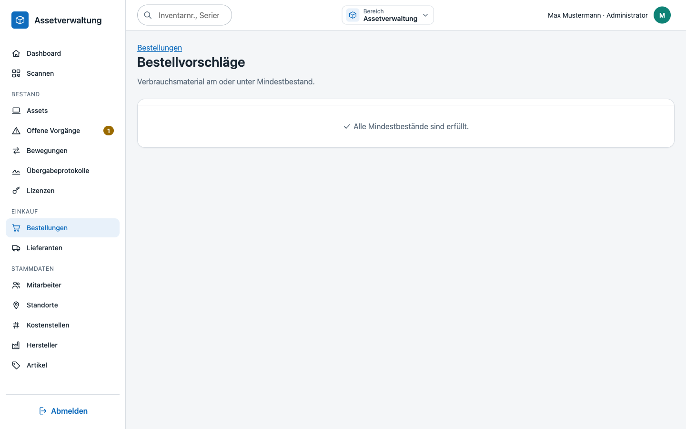
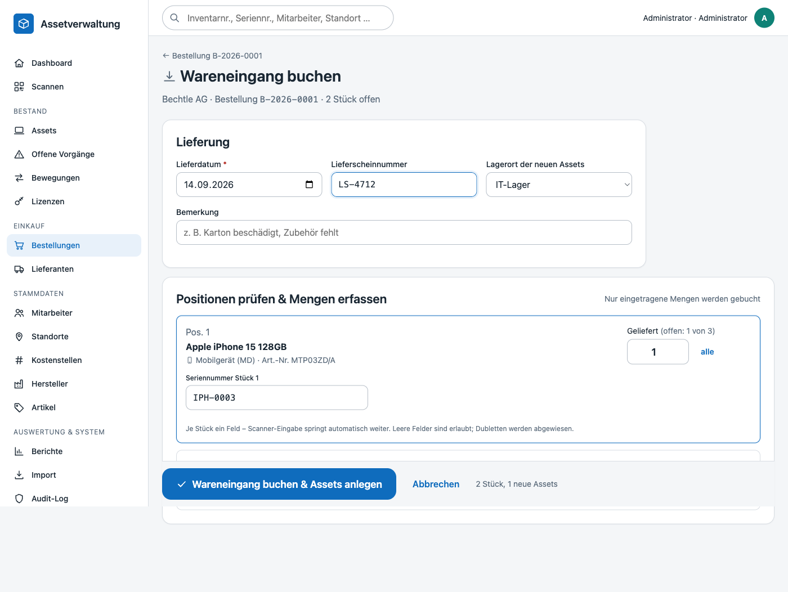
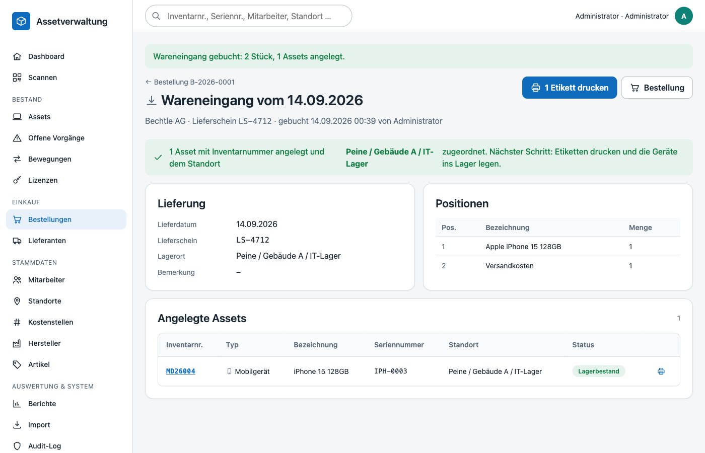
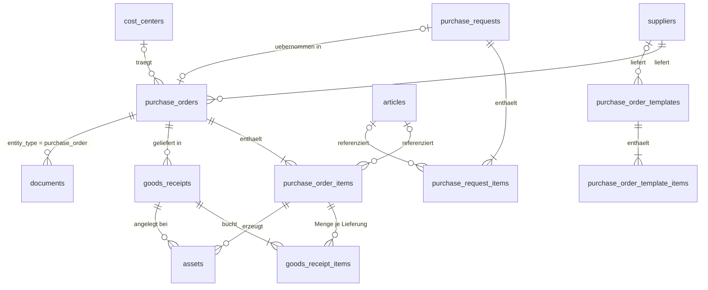

# Einkauf – Bestellungen & Wareneingang

Der Einkauf bildet den Weg von der Bestellung bis zum inventarisierten Gerät ab: Eine **Bestellung** (`purchase_orders`) fasst Positionen (`purchase_order_items`) bei einem Lieferanten zusammen. Beim **Wareneingang** (`goods_receipts`) werden gelieferte Mengen gebucht – auch in mehreren Teil-Lieferungen – und für jede gelieferte Einheit entsteht automatisch ein Asset mit Inventarnummer, Seriennummer, Einkaufsdaten und Lagerort. Die Assets sind dauerhaft mit Bestellung, Position und Lieferung verknüpft.



## Bestellungen (`/orders`)

Die Liste zeigt Bestellungen mit Lieferant, Bestell- und Lieferdatum, Besteller, Positionsanzahl, Lieferfortschritt (geliefert/gesamt als Balken) und Netto-Bestellwert. Statuskarteireiter mit Zählern filtern schnell:

| Reiter | Inhalt |
|---|---|
| **Offen** (Standard) | Status *Bestellt* und *Teilweise geliefert* – alles, worauf noch Ware erwartet wird |
| **Überfällig** | offene Bestellungen, deren erwartetes Lieferdatum überschritten ist |
| Entwürfe, Bestellt, Teilgeliefert, Geliefert, Abgeschlossen, Storniert | jeweils genau ein Status |
| **Alle** | ohne Statusfilter |

Zusätzlich lassen sich Volltext (Bestellnummer, Lieferant, Bemerkung, Positionstext), Lieferant, Kostenstelle und Bestelldatum-Zeitraum filtern. Die Kopfzeile verlinkt außerdem Bedarfsmeldungen (`/orders/requests`) und Bestellvorlagen (`/orders/templates`). Das Dashboard verlinkt die Zahl der offenen Bestellungen, die Lieferantenseite alle Bestellungen des Lieferanten.

### Kopfdaten

| Feld | Bedeutung |
|---|---|
| Bestellnummer | automatisch `B-JJJJ-NNNN` (jahresweise fortlaufend) oder manuell, z. B. die Nummer aus dem ERP; eindeutig (Groß-/Kleinschreibung und Leerzeichen werden normalisiert) |
| Lieferant | Pflicht, nur aktive Lieferanten |
| Bestelldatum | wird beim Markieren als *bestellt* gesetzt, falls leer |
| Besteller | vorbelegt mit dem angemeldeten Benutzer; ein abweichender Freitextname ist möglich |
| Erwartetes Lieferdatum | steuert *Überfällig*; darf nicht vor dem Bestelldatum liegen |
| Kostenstelle | wird an die erzeugten Assets vererbt |
| Bemerkung | Freitext |

### Statusfluss



| Status | Anzeige | Positionen änderbar | Wareneingang möglich |
|---|---|---|---|
| `draft` | Entwurf | ja | nein |
| `ordered` | Bestellt | ja, bis zur ersten Lieferung | ja |
| `partially_delivered` | Teilweise geliefert | nein | ja |
| `delivered` | Vollständig geliefert | nein | nein |
| `closed` | Abgeschlossen (z. B. nach Rechnungsprüfung) | nein | nein |
| `cancelled` | Storniert | nein | nein |

Der Status *Teilweise geliefert* / *Vollständig geliefert* wird nach jedem Wareneingang aus den Positionsmengen berechnet. Stornieren ist nur möglich, solange nichts geliefert wurde; der Grund wird der Bemerkung angehängt und im Audit-Log protokolliert.

## Positionen



Positionen werden direkt auf der Bestellseite erfasst. Zwei Arten:

- **Artikelposition** – Auswahl aus dem Artikelstamm. Bezeichnung (`Hersteller Artikelname`) und Assettyp werden übernommen; die erzeugten Assets erhalten Artikel, Hersteller und Typ.
- **Freie Position** – beliebige Bezeichnung mit optionalem Assettyp. Ohne Haken *erzeugt Assets* (z. B. Versandkosten, Dienstleistungen) wird die Menge nur mitgezählt, es entstehen keine Assets.

Weitere Felder: Menge (1–10 000), Netto-Einzelpreis (deutsche oder englische Schreibweise), Bemerkung. Die Fußzeile summiert Menge, gelieferte Menge und Gesamtwert. Regeln:

- Positionen, die Assets erzeugen, benötigen einen Assettyp (direkt oder über den Artikel).
- Die Menge kann nicht unter die bereits gelieferte Menge gesenkt werden; Positionen mit Lieferungen lassen sich nicht löschen.
- Positionsnummern werden nicht wiederverwendet.

## Bestellvorlagen (`/orders/templates`)

Wiederkehrende Bestellungen – Standard-Notebook, Monitorpaket, Verbrauchsmaterial – lassen sich als Vorlage ablegen: `Als Vorlage speichern` auf der Bestellseite fragt einen Namen ab (vorbelegt mit dem Lieferanten) und kopiert Lieferant, Kostenstelle, Bemerkung und **alle Positionen** in `purchase_order_templates` / `purchase_order_template_items`. Die Bestellung selbst bleibt unverändert; Vorlagen sind also unabhängige Kopien und ändern sich nicht mehr mit.

Die Übersicht listet Name, Lieferant, Kostenstelle und Positionsanzahl. `Entwurf erstellen` legt eine neue Bestellung im Status *Entwurf* an – mit neuer Bestellnummer – und fügt die Positionen über die normalen Positionsregeln ein (Assettyp aus dem Artikel, Verbrauchsmaterial ohne Assets). Anschließend wird direkt auf den Entwurf verzweigt, der wie jede andere Bestellung geprüft, ergänzt und als *bestellt* markiert wird. Vorlagen ohne Lieferant lassen sich nicht verwenden; der Aufruf wird mit einem Hinweis abgebrochen.



## Bedarfsmeldungen (`/orders/requests`)

Bedarfsmeldungen sind der Weg für alle, die selbst nicht bestellen dürfen: Jede Rolle mit `orders.view` kann melden, was gebraucht wird, ohne Zugriff auf Lieferanten und Preise.

| Feld | Bedeutung |
|---|---|
| Artikel | Auswahl aus dem Artikelstamm (nur aktive Artikel); die Bezeichnung wird aus `Hersteller Artikelname` übernommen |
| Bezeichnung | Freitext, wenn kein Artikel passt – ohne Artikel Pflicht |
| Menge | mindestens 1 |
| Kostenstelle | optional, wird in die spätere Bestellung übernommen |
| Begründung / Hinweis | Freitext, landet als Bemerkung in der Bestellung |

Die Liste zeigt eigene Meldungen; mit `orders.manage` sind alle Meldungen sichtbar – sortiert nach Status (offen zuerst) und Meldedatum. Der Einkauf wählt zu einer offenen Meldung einen Lieferanten und übernimmt sie mit `In Bestellung übernehmen`: In einer Transaktion wird die Meldung auf *Übernommen* gesetzt, ein Bestellentwurf mit der Bemerkung `Aus Bedarfsmeldung #<Nr.>` angelegt und jede Bedarfsposition als Bestellposition eingefügt. Die Meldung verlinkt danach dauerhaft auf die Bestellung.

Der Statuswechsel erfolgt als atomare Reservierung (`open → converted`); eine zweite, gleichzeitige Übernahme schlägt mit einem Konflikt fehl, sodass keine doppelten Bestellungen entstehen.

| Status | Bedeutung |
|---|---|
| `open` | gemeldet, noch nicht bearbeitet – erscheint auf dem Dashboard des Melders |
| `converted` | in einen Bestellentwurf übernommen (`purchase_order_id` gesetzt) |
| `cancelled` | verworfen |



## Verbrauchsmaterial und Bestellvorschläge (`/orders/replenishment`)

Artikel, die nicht inventarisiert werden (Toner, Kabel, Batterien), lassen sich im Artikelstamm als **Verbrauchsmaterial** kennzeichnen und erhalten dann *Mindestbestand* und *Aktuellen Bestand*. Wird der Haken entfernt, setzt die Anwendung Mindestbestand und Bestand zurück.

- Positionen mit einem Verbrauchsartikel erzeugen **nie** Assets oder Inventarnummern – das Häkchen *erzeugt Assets* wird beim Speichern automatisch entfernt und die Position auf der Bestellseite als *Verbrauchsmaterial* gekennzeichnet.
- Beim Wareneingang erhöht die gelieferte Menge stattdessen den Lagerbestand des Artikels (`articles.stock_quantity`) – in derselben Transaktion wie die Lieferung.
- Die Artikelliste zeigt `Bestand / Mindestbestand`, gelb markiert, sobald der Mindestbestand erreicht ist.

Die Seite **Bestellvorschläge** listet alle aktiven Verbrauchsartikel mit gepflegtem Mindestbestand, deren Bestand kleiner oder gleich dem Mindestbestand ist, samt Vorschlagsmenge (Auffüllen bis zum doppelten Mindestbestand, mindestens 1 Stück). Nach Auswahl eines Lieferanten erzeugt `Bestellentwurf erzeugen` eine Bestellung im Status *Entwurf* mit der Bemerkung *Automatisch aus Bestandsunterschreitungen erstellt* und je Vorschlag eine Position. Sind alle Mindestbestände erfüllt, bleibt die Seite leer.



## Wareneingang



`Wareneingang buchen` ist ab Status *Bestellt* verfügbar. Kopf der Lieferung: Lieferdatum (nicht in der Zukunft), Lieferscheinnummer, Lagerort (vorbelegt mit dem ersten aktiven Lagerort vom Typ *Lager* bzw. mit „Lager“ im Namen) und Bemerkung.

Je Position wird die **gelieferte Menge** eingegeben (Schaltfläche *alle* setzt die offene Restmenge). Für Positionen, die Assets eines Typs mit Seriennummernpflicht erzeugen, erscheinen so viele Seriennummernfelder wie Stück eingegeben wurden; die Eingabetaste springt zum nächsten Feld, damit sich Seriennummern direkt vom Barcodescanner erfassen lassen. Doppelte Seriennummern innerhalb der Lieferung werden sofort markiert.

Beim Buchen passiert in **einer Transaktion**:

1. `goods_receipts` und je Position eine Zeile `goods_receipt_items` (Menge, Bemerkung) werden angelegt.
2. `purchase_order_items.quantity_received` wird erhöht; die Restmenge darf nicht überschritten werden.
3. Bei Positionen mit einem Verbrauchsartikel wird stattdessen `articles.stock_quantity` um die gelieferte Menge erhöht – es entstehen keine Assets.
4. Für jede gelieferte Einheit einer Asset-Position entsteht ein Asset über den regulären `AssetService` – mit neuer Inventarnummer, Assettyp, Artikel, Seriennummer, Lieferant, Kaufdatum (= Lieferdatum), Einkaufspreis (= Einzelpreis), Kostenstelle der Bestellung, Lagerort der Lieferung, Status *Lagerbestand* sowie den Verweisen `purchase_order_id`, `purchase_order_item_id`, `goods_receipt_id`. Die Asset-Historie erhält den Eintrag *Wareneingang*.
5. Der Bestellstatus wird neu berechnet und die Buchung im Audit-Log festgehalten.

Schlägt ein Schritt fehl – etwa weil eine Seriennummer im Assettyp bereits vergeben ist –, wird die gesamte Lieferung verworfen und der Fehler am betroffenen Feld angezeigt. Eingaben bleiben erhalten.



Nach dem Buchen zeigt die Lieferungsseite die gebuchten Positionen und die neu angelegten Assets; *Alle Etiketten drucken* öffnet die Etikettenvorschau (`/labels?ids=…`) für genau diese Assets. Die Bestellseite listet alle Lieferungen und alle aus der Bestellung erzeugten Assets, mit Link in die gefilterte Assetliste (`/assets?purchase_order_id=…`).

## Dokumente

Zur Bestellung können Bestellung, Auftragsbestätigung, Lieferschein, Rechnung usw. hochgeladen werden (PDF, Bilder, Office-Formate; Größe laut `UPLOAD_MAX_MB`). Dateien liegen außerhalb des Webroots und werden über `/documents/{id}` mit Berechtigungsprüfung ausgeliefert. Löschen entfernt Datei und Datensatz.

## Berechtigungen

| Recht | admin | einkauf | lager | assetmanagement | readonly |
|---|---|---|---|---|---|
| `orders.view` – Bestellungen, Vorlagen, Bestellvorschläge sehen und Bedarf melden | ✓ | ✓ | ✓ | ✓ | ✓ |
| `orders.manage` – anlegen, ändern, Status, Positionen, stornieren, Vorlagen speichern/verwenden, Bedarfe übernehmen, Bestellvorschläge erzeugen | ✓ | ✓ | – | – | – |
| `orders.receive` – Wareneingang buchen | ✓ | ✓ | ✓ | – | – |
| `documents.manage` – Dokumente hochladen/löschen | ✓ | ✓ | ✓ | ✓ | – |

Der Wareneingang legt Assets ohne zusätzliche `assets.manage`-Prüfung an, damit die Rolle *Einkauf* Lieferungen buchen kann.

## Datenmodell



Migration `002_goods_receipt_items.sql` ergänzt `goods_receipt_items.note`, `goods_receipts.location_id` und `assets.goods_receipt_id`. Migration `007_procurement_workflows.sql` legt `purchase_order_templates`, `purchase_order_template_items`, `purchase_requests` und `purchase_request_items` an und ergänzt `articles` um `is_consumable`, `minimum_stock` und `stock_quantity`.

## Tests

`tests/Integration/PurchaseOrderServiceIntegrationTest.php` deckt ab: fortlaufende Bestellnummern, Validierung (doppelte Nummer, Lieferdatum vor Bestelldatum), Statusübergänge (bestellt nur mit Positionen, stornieren nur ohne Lieferung, abschließen/wieder öffnen), Positionsregeln (Typ aus Artikel, Assettyp-Pflicht, Sperre nach erster Lieferung), Teil- und Restlieferung mit Asset-Erzeugung, Historie und Verknüpfungen, Ablehnung von Übermengen, doppelten und bereits vergebenen Seriennummern inkl. Rollback, Verbrauchsmaterial (Wareneingang ohne Assets, nur Bestandserhöhung), Bedarfsmeldungen (Artikelauswahl ohne Freitext, einmalige Übernahme) sowie die Rollenrechte.

```bash
docker compose exec app php tests/run.php --integration --filter=PurchaseOrder
```
