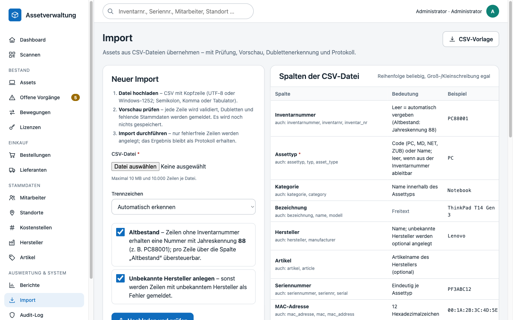
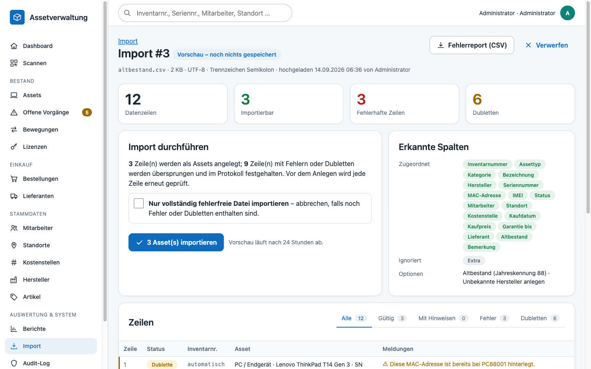
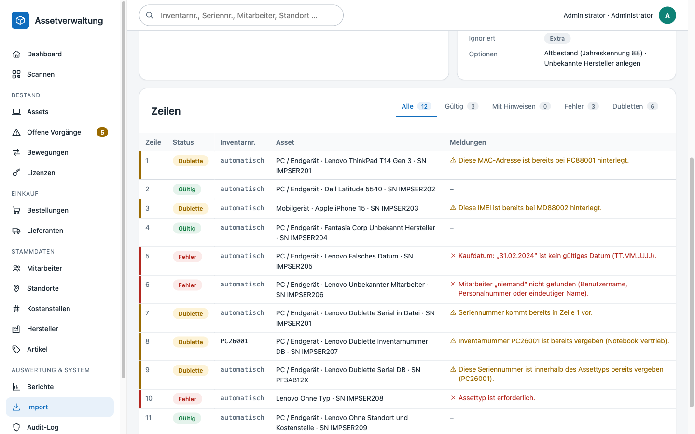
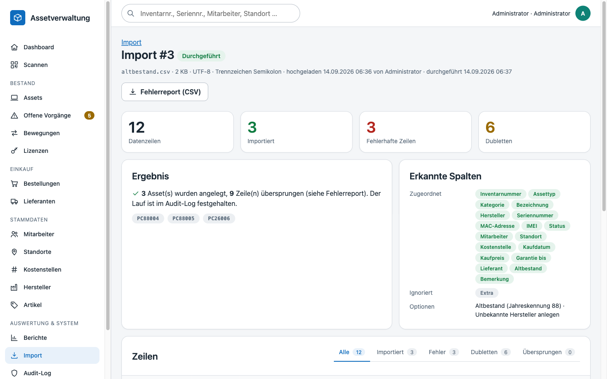

# Import – Altbestand aus CSV übernehmen

Der **Import** (`/imports`) übernimmt Assets aus CSV-Dateien – z. B. aus einem Altsystem, einer Excel-Liste oder einer Lieferantenaufstellung. Kein Datensatz gelangt ungeprüft in die Datenbank: Jede Datei wird zuerst vollständig analysiert und als **Vorschau** dargestellt; erst nach ausdrücklicher Bestätigung werden die fehlerfreien Zeilen angelegt. Jeder Lauf bleibt als **Importprotokoll** mit allen Zeilen, Meldungen und den angelegten Assets erhalten.

Berechtigung: `imports.manage` (Rollen *Assetmanagement* und *Admin*).

## Ablauf

1. **Datei hochladen** – CSV mit Kopfzeile (`.csv` oder `.txt`, max. 10 MB, 10.000 Datenzeilen). Kodierung (UTF‑8 mit/ohne BOM, Windows‑1252) und Trennzeichen (`;` `,` Tabulator `|`) werden automatisch erkannt; das Trennzeichen kann vorgegeben werden. Die **CSV-Vorlage** (`/imports/template`) enthält alle Spalten und zwei Beispielzeilen.
2. **Vorschau prüfen** – jede Zeile wird mit denselben Regeln geprüft wie die manuelle Anlage (`AssetService`). Kennzahlen, erkannte/ignorierte Spalten und die Zeilentabelle mit Status und Meldungen zeigen, was passieren würde. Der **Fehlerreport (CSV)** enthält nur die Problemzeilen samt Originaldaten und Meldung – ideal zum Korrigieren und erneuten Hochladen.
3. **Import durchführen** – legt alle Zeilen mit Status *Gültig* oder *Hinweis* an; Zeilen mit *Fehler* oder *Dublette* werden übersprungen und protokolliert. Die Option *Nur vollständig fehlerfreie Datei importieren* bricht stattdessen ab, sobald eine Problemzeile enthalten ist. Vor dem Anlegen wird jede Zeile **erneut geprüft** (Daten könnten sich seit der Vorschau geändert haben); das Anlegen läuft in einer Transaktion.
4. Alternativ **Verwerfen**: die Vorschau wird verworfen und die hochgeladene Datei gelöscht. Nicht bestätigte Vorschauen verfallen automatisch nach 24 Stunden.

## Optionen

| Option | Wirkung |
|---|---|
| **Altbestand** (Standard: an) | Zeilen ohne Inventarnummer erhalten eine Nummer mit Jahreskennung **88** (z. B. `PC88001`) und `is_legacy = 1`. Die Spalte *Altbestand* (Ja/Nein) übersteuert die Option je Zeile. |
| **Unbekannte Hersteller anlegen** (Standard: an) | Hersteller, die weder exakt noch phonetisch (Kölner Phonetik) gefunden werden, werden beim Import angelegt (Hinweis in der Vorschau). Ohne die Option ist ein unbekannter Hersteller ein Fehler – die Meldung nennt ähnliche vorhandene Namen. |
| **Trennzeichen** | *Automatisch* (Zählung in der Kopfzeile) oder fest Semikolon/Komma/Tabulator/Senkrechter Strich. |

## Spalten

Die Spaltenreihenfolge ist beliebig; Kopfzeilen werden normalisiert (Kleinschreibung, Umlaute → ae/oe/ue, Sonderzeichen → `_`) und über Bezeichnung oder Alias zugeordnet. Nicht zugeordnete Spalten werden ignoriert und in der Vorschau unter *Ignoriert* aufgeführt. Mindestens *Assettyp* oder *Inventarnummer* muss vorhanden sein.

| Spalte | Aliasse | Bedeutung | Beispiel |
|---|---|---|---|
| **Inventarnummer** | `inventarnummer`, `inventarnr`, `inventar_nr`, `inventory_number`, `inv_nr` | Leer = automatisch vergeben (Altbestand: Jahreskennung 88); sonst muss sie zum Typpräfix passen und frei sein | `PC88001` |
| **Assettyp** \* | `assettyp`, `typ`, `asset_type`, `type`, `geraetetyp` | Code (PC, MD, NET, ZUB) oder Name; leer, wenn aus der Inventarnummer ableitbar | `PC` |
| **Kategorie** | `kategorie`, `category` | Name innerhalb des Assettyps (unbekannt → Hinweis, wird ignoriert) | `Notebook` |
| **Bezeichnung** | `bezeichnung`, `name`, `modell`, `model`, `geraet` | Freitext | `ThinkPad T14 Gen 3` |
| **Hersteller** | `hersteller`, `manufacturer` | Name; unbekannte Hersteller werden optional angelegt | `Lenovo` |
| **Artikel** | `artikel`, `article` | Artikelname des Herstellers (unbekannt → Hinweis) | – |
| **Seriennummer** | `seriennummer`, `seriennr`, `serial`, `serial_number`, `sn`, `s_n` | Eindeutig je Assettyp | `PF3ABC12` |
| **MAC-Adresse** | `mac_adresse`, `mac`, `mac_address` | 12 Hexadezimalzeichen, beliebige Trenner | `00:1A:2B:3C:4D:5E` |
| **IMEI** | `imei` | 14–16 Ziffern | – |
| **Status** | `status`, `zustand` | Code oder Name; Standard „Lagerbestand“, mit Mitarbeiter „Ausgegeben“. Endstatus (Ausgemustert/Entsorgt) erfordert `assets.retire` | `Lagerbestand` |
| **Mitarbeiter** | `mitarbeiter`, `benutzername`, `username`, `employee`, `personalnummer`, `benutzer` | Benutzername, Personalnummer oder eindeutiger Anzeigename (inaktiv → Hinweis) | `mmustermann` |
| **Standort** | `standort`, `location`, `raum`, `ort` | Pfad „Gebäude / Etage / Raum“, Kürzel oder eindeutiger Name | `Peine / Gebäude A / IT-Lager` |
| **Kostenstelle** | `kostenstelle`, `cost_center`, `kst` | Fünfstellige Nummer | `12345` |
| **Kaufdatum** | `kaufdatum`, `purchase_date`, `anschaffungsdatum`, `anschaffung` | TT.MM.JJJJ oder JJJJ-MM-TT | `15.03.2024` |
| **Kaufpreis** | `kaufpreis`, `preis`, `purchase_price`, `anschaffungskosten`, `anschaffungswert` | Betrag, `1.234,56` oder `1234.56`; Währungszeichen werden entfernt | `1299,00` |
| **Garantie bis** | `garantie_bis`, `garantie`, `warranty_until`, `garantieende`, `warranty` | TT.MM.JJJJ oder JJJJ-MM-TT | `14.03.2027` |
| **Lieferant** | `lieferant`, `supplier`, `haendler` | Name (unbekannt → Hinweis, wird ignoriert) | `Bechtle AG` |
| **Altbestand** | `altbestand`, `legacy`, `is_legacy` | Ja/Nein (auch 1/0, x, true/false); Standard aus den Importoptionen | `Ja` |
| **Bemerkung** | `bemerkung`, `notiz`, `note`, `kommentar`, `anmerkung` | Freitext | `Aus Altsystem übernommen` |

\* Pflicht, sofern nicht aus der Inventarnummer ableitbar.

## Zeilenstatus

| Status | Bedeutung | Wird importiert? |
|---|---|---|
| **Gültig** | Alle Prüfungen bestanden | ja |
| **Hinweis** | Importierbar, aber mit Abweichung (Hersteller wird neu angelegt, Kategorie/Artikel/Lieferant unbekannt und ignoriert, Mitarbeiter inaktiv) | ja |
| **Fehler** | Pflichtfeld fehlt, Referenz nicht gefunden (Typ, Status, Mitarbeiter, Standort, Kostenstelle), ungültiges Datum/Format, fehlende Berechtigung | nein |
| **Dublette** | Inventarnummer, Seriennummer (je Typ), MAC-Adresse oder IMEI ist bereits vergeben – in der Datenbank **oder** weiter oben in derselben Datei („kommt bereits in Zeile n vor“) | nein |
| **Importiert** | Asset wurde angelegt (mit Link) | – |
| **Übersprungen** | Beim Durchführen nicht angelegt (z. B. Abbruch im strikten Modus) | – |

## Importprotokoll

Unter `/imports` werden alle Läufe mit Zeitpunkt, Datei, Status (*Vorschau*, *Durchgeführt*, *Verworfen*, *Fehlgeschlagen*), Benutzer und Zählern gelistet. Die Detailseite eines durchgeführten Laufs zeigt dauerhaft je Zeile Status, Meldungen, Originaldaten und das angelegte Asset; der Fehlerreport bleibt abrufbar. Zusätzlich schreibt jeder Import/Abbruch einen Eintrag ins Audit-Log (`import` bzw. `cancel` auf `import_run`), und jedes angelegte Asset erhält – wie bei der manuellen Anlage – einen Historieneintrag.

Die hochgeladene Datei wird nur für die Dauer der Vorschau unter `storage/uploads/imports/` aufbewahrt und nach Durchführung, Verwerfen oder Ablauf gelöscht; die Zeilendaten liegen danach ausschließlich im Protokoll (`import_rows.data`).

## Technik

| Baustein | Aufgabe |
|---|---|
| `App\Support\CsvReader` | BOM-/Kodierungs-/Trennzeichenerkennung, Header-Normalisierung, `fgetcsv` mit Zeilenlimit |
| `App\Services\ImportService` | Upload-Validierung, Spaltenzuordnung (`COLUMNS`), Zeilenanalyse (`analyseRow`), Durchführung in Transaktion, Fehlerreport, Vorlage, Aufräumen abgelaufener Vorschauen |
| `App\Repositories\ImportRepository` | Tabellen `import_runs` (Lauf, Zähler, Optionen, erkannte Spalten) und `import_rows` (Zeile, Status, Meldungen JSON, Daten JSON, Asset) |
| `App\Controllers\ImportController` | Routen `/imports`, `/imports/template`, `/imports/{id}`, `/imports/{id}/commit`, `/imports/{id}/cancel`, `/imports/{id}/errors` |

Die Zeilenprüfung ruft `AssetService::validateNew()` auf – dieselbe Validierung wie im Formular; Duplikate mit „bereits vergeben“ werden als *Dublette* statt *Fehler* eingestuft. Tests: `tests/Unit/CsvReaderTest.php`, `tests/Integration/ImportServiceIntegrationTest.php`.
