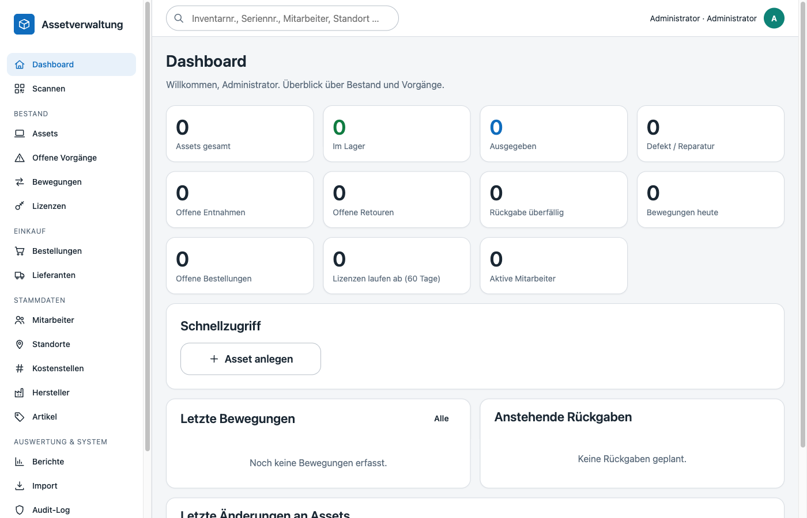

# Installation & Betrieb

Die Anwendung läuft vollständig in Docker: ein **App-Container** (PHP 8.4 + Apache, Image aus `docker/php/Dockerfile`), ein **MySQL 8.4**-Container und ein **PDF-Container** (`docker/pdf/Dockerfile`, Python + WeasyPrint, nur intern erreichbar; erzeugt die PDFs der [Übergabeprotokolle](uebergabeprotokoll.md), konfiguriert über `PDF_SERVICE_URL`/`PDF_SERVICE_TIMEOUT`). Es werden keine externen Laufzeitabhängigkeiten, kein Composer, kein Node und keine CDNs benötigt – alles Notwendige liegt im Repository.

## Voraussetzungen

- Docker Engine ≥ 24 mit Docker Compose v2
- Ein freier Host-Port für die Anwendung (Standard `8080`)
- Für Active Directory: Netzwerkzugriff vom App-Container auf den Domänencontroller (LDAPS, Port 636)

## Erstinstallation

```bash
git clone <repository> assets && cd assets
cp .env.example .env
```

Anschließend die `.env` anpassen – mindestens:

| Variable | Bedeutung |
|---|---|
| `APP_URL` | Öffentliche Basis-URL (wird für Links auf Etiketten/QR-Codes verwendet) |
| `APP_COMPANY_NAME` | Firmenname auf Etiketten und Anmeldeseite |
| `DB_PASSWORD`, `DB_ROOT_PASSWORD` | Datenbankpasswörter (Anwendungsbenutzer / root) |
| `ADMIN_USERNAME`, `ADMIN_PASSWORD` | Erster Administrator – wird **nur** angelegt, wenn noch kein Benutzer existiert |
| `SESSION_SECURE` | Leer = HTTPS automatisch erkennen; `true` erzwingt `Secure`-Cookies (hinter TLS-Proxy empfohlen) |

Start:

```bash
docker compose up --build -d
docker compose logs -f app     # Migrationen und Seeder laufen beim ersten Start automatisch
```

Der Entrypoint (`docker/php/entrypoint.sh`) wartet auf die Datenbank, führt `php bin/migrate.php` aus (Schema, Stammdaten-Seeder, Erst-Admin) und startet danach Apache. Die Anwendung ist unter `APP_URL` erreichbar; die Anmeldung erfolgt mit `ADMIN_USERNAME` / `ADMIN_PASSWORD`. Das Passwort sollte danach unter *Profil → Passwort ändern* geändert und der Wert in der `.env` entfernt werden – er wird nach der Erstanlage nicht mehr benötigt.



### Erste Schritte nach der Installation

1. **Administration → Einstellungen**: Etikettenlayout, Firmenname, Jahreskennung prüfen ([Etiketten](labels.md)).
2. **Stammdaten** anlegen: Standorte (Baum), Kostenstellen, Hersteller, Lieferanten; Assettypen und Kategorien sind vorbelegt (PC, MD, NET, ZUB).
3. **Benutzer und Rollen** unter *Administration → Benutzer* (Rollen: Admin, Assetmanagement, Lager, Einkauf, Nur lesen – siehe [Architektur → Berechtigungen](architektur.md#berechtigungen)).
4. Optional **Active Directory** aktivieren und einen ersten Sync starten ([AD-Synchronisation](ad-sync.md)).
5. Optional **Altbestand** per CSV übernehmen ([Import](import.md)).

## Konfiguration (`.env`)

Alle Einstellungen werden über Umgebungsvariablen gelesen (`docker compose` liest die `.env`); es gibt keine Konfigurationsdateien mit Geheimnissen im Repository.

| Bereich | Variablen |
|---|---|
| Anwendung | `APP_ENV` (`production`/`development`), `APP_DEBUG`, `APP_NAME`, `APP_URL`, `APP_PORT`, `APP_TIMEZONE`, `APP_COMPANY_NAME` |
| Datenbank | `DB_HOST`, `DB_PORT`, `DB_DATABASE`, `DB_USERNAME`, `DB_PASSWORD`, `DB_ROOT_PASSWORD`, `DB_FORWARD_PORT` (nur Entwicklung) |
| Session | `SESSION_SECURE`, `SESSION_LIFETIME` (Minuten, Standard 480), `SESSION_SAME_SITE` |
| Uploads | `MAX_UPLOAD_BYTES` (Standard 20 MB), `ALLOWED_UPLOAD_EXTENSIONS` |
| Active Directory | `AD_ENABLED`, `AD_DRIVER` (`ldap`/`fake`), `AD_HOST`, `AD_PORT`, `AD_BASE_DN`, `AD_BIND_DN`, `AD_BIND_PASSWORD`, `AD_USER_FILTER`, `AD_ATTR_*` (Attribut-Mapping), `AD_SYNC_INTERVAL_MINUTES`, `AD_AUTH_ENABLED`, `AD_AUTH_DEFAULT_ROLE` |

`APP_DEBUG=true` zeigt Fehlerdetails im Browser und gehört ausschließlich in Entwicklungsumgebungen. In Produktion werden Fehler mit einer Referenz-ID angezeigt und vollständig im Log protokolliert.

## Betrieb hinter einem Reverse Proxy (HTTPS)

Die Anwendung terminiert kein TLS selbst. Empfohlen ist ein Reverse Proxy (nginx, Traefik, Caddy, IIS ARR) vor Port `APP_PORT`, der HTTPS bereitstellt und die Header `X-Forwarded-Proto` und `X-Forwarded-For` setzt. Dann:

- `APP_URL=https://assets.example.local` (QR-Codes auf Etiketten zeigen auf diese URL)
- `SESSION_SECURE=true`
- Die PWA (mobile Erfassung, Offline-Betrieb) setzt HTTPS voraus – Service Worker werden nur über HTTPS oder `localhost` registriert.

Das Upload-Limit ist zusätzlich im Proxy freizugeben (z. B. `client_max_body_size 20m` bei nginx). PHP-seitig ist `upload_max_filesize`/`post_max_size` in `docker/php/php.ini` gesetzt.

## Persistente Daten

| Docker-Volume | Inhalt |
|---|---|
| `assets_db` | MySQL-Datenverzeichnis |
| `assets_uploads` | Hochgeladene Dokumente (`storage/uploads/documents`) und Importdateien (`storage/uploads/imports`, temporär bis Import/Verwerfen) |
| `assets_logs` | Anwendungs-Logs (`storage/logs/app-YYYY-MM-DD.log`) |
| `assets_labels` | Hochgeladenes Etikettenlogo (`storage/labels/`) |

Sicherung und Wiederherstellung sind in [Backup & Wiederherstellung](backup.md) beschrieben.

## Update auf eine neue Version

```bash
git pull
docker compose up --build -d
```

Datenbankmigrationen (`database/migrations/*.sql`) werden beim Containerstart automatisch und nur einmal ausgeführt (Tabelle `schema_migrations`). Vor einem Update sollte ein Backup erstellt werden. Der Vorgang ist ohne Downtime nur dann möglich, wenn keine Migration anfällt; ansonsten dauert die Nichtverfügbarkeit die Migrationszeit (bei üblichen Datenmengen wenige Sekunden).

Manuelle Migration (z. B. bei `SKIP_MIGRATIONS=1`):

```bash
docker compose exec app php bin/migrate.php            # offen stehende Migrationen anwenden
docker compose exec app php bin/migrate.php --no-seed  # ohne Stammdaten-Seeder
```

## Zeitgesteuerte Aufgaben

- **AD-Synchronisation**: entweder `AD_SYNC_INTERVAL_MINUTES` setzen (ein Scheduler-Prozess im App-Container, `docker/php/scheduler.sh`) oder per Host-Cron `docker compose exec -T app php bin/sync-ad.php --by=cron --quiet` aufrufen.
- **Aufräumen**: Abgelaufene Importvorschauen (24 h) werden beim nächsten Aufruf der Importseite automatisch entfernt; Sitzungen laufen nach `SESSION_LIFETIME` ab.

## Logging

Logs liegen als Tagesdateien in `storage/logs/` (Volume `assets_logs`), Format `Zeit [LEVEL] Nachricht {JSON-Kontext}`. Jede Anfrage wird mit Methode, Pfad, Statuscode, Dauer und Benutzer-ID protokolliert (`RequestLogMiddleware`); Fehler enthalten Exception, Datei/Zeile und eine Referenz-ID, die dem Benutzer angezeigt wird. Passwörter, Session-Tokens und CSRF-Tokens werden nie geloggt; Anfrageparameter werden nicht mitgeschrieben.

```bash
docker compose exec app tail -f storage/logs/app-$(date +%F).log
```

## Gesundheitsprüfung

`GET /health` antwortet ohne Anmeldung mit `{"status":"ok"}` und eignet sich für Container-Healthchecks oder Monitoring. Der MySQL-Container hat einen eigenen Healthcheck (`mysqladmin ping`), auf den der App-Container beim Start wartet.

## Entwicklung

`docker-compose.override.yml` wird von Docker Compose automatisch mitgeladen: Es bindet den Quellcode live in den Container ein und gibt MySQL auf `DB_FORWARD_PORT` (Standard 3307) frei. Für Produktion die Override-Datei nicht mitliefern oder explizit nur `docker compose -f docker-compose.yml up -d` verwenden.

```bash
docker compose exec app php tests/run.php            # alle Tests (Unit + Integration gegen assets_test)
docker compose exec app php tests/run.php --unit     # nur Unit-Tests
docker compose exec app php tests/run.php --filter=Import
```

Die Test-Datenbank `<DB_DATABASE>_test` wird beim ersten MySQL-Start angelegt (`docker/mysql/init/01-test-database.sh`); Integrationstests laufen in Transaktionen und lassen keine Daten zurück. Für die AD-Entwicklung steht `AD_DRIVER=fake` mit `database/fixtures/fake-ad-users.json` zur Verfügung.
