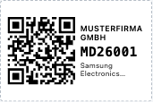
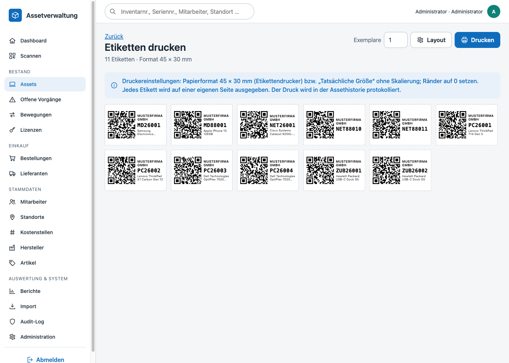
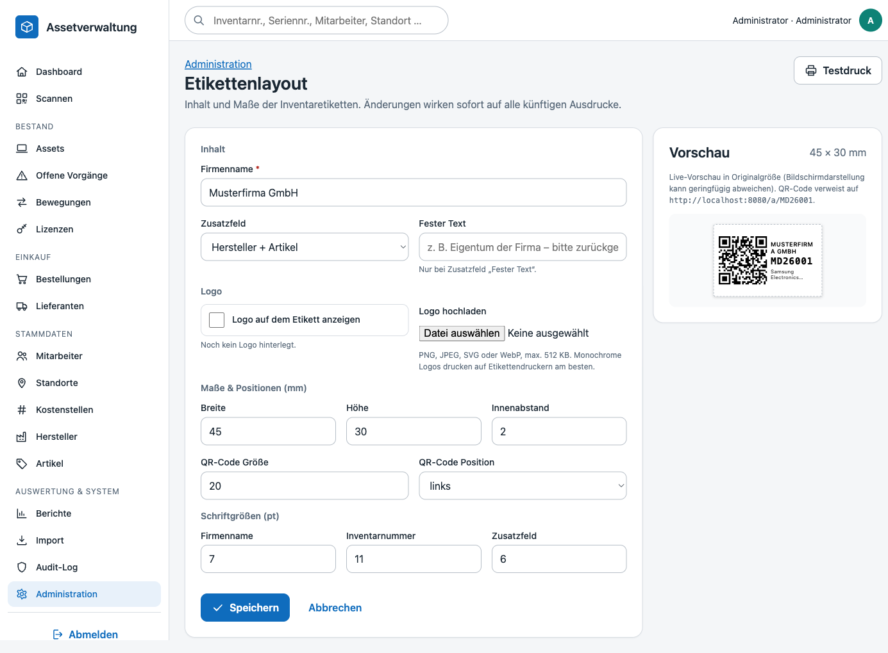

# Etiketten & QR-Codes

Jedes Asset erhält ein Inventaretikett mit QR-Code, Firmenname und Inventarnummer. Die Etiketten werden direkt aus dem Browser gedruckt – ohne externe Dienste oder Bibliotheken.

## Aufbau

| Element | Inhalt | Einstellung |
|---|---|---|
| QR-Code | URL `APP_URL/a/{Inventarnummer}` (z. B. `https://assets.example.com/a/PC26001`) | Größe in mm, Position links / rechts / oben |
| Firmenname | frei wählbar, Großbuchstaben, maximal zwei Zeilen | Text, Schriftgröße |
| Inventarnummer | Monospace, fett – wird **nie abgeschnitten** (die Schrift wird bei Bedarf automatisch verkleinert) | Schriftgröße |
| Zusatzfeld (optional) | Bezeichnung, Hersteller + Artikel, Seriennummer, Assettyp, Standort, Kostenstelle, Kaufdatum oder ein fester Text | Feld, Schriftgröße |
| Logo (optional) | PNG, JPEG, SVG oder WebP, max. 512 KB; monochrome Logos drucken am besten | Datei, ein/aus |

Standardformat ist **45 × 30 mm** (Etikettendrucker, z. B. Brother QL / Zebra), Breite 20–150 mm und Höhe 15–100 mm sind einstellbar. Der QR-Code muss in die Fläche abzüglich Innenabstand passen – das Formular prüft das beim Speichern.

## QR-Code

Der QR-Code wird serverseitig von `App\Support\QrCode` erzeugt (ISO/IEC 18004, Byte-Modus, Versionen 1–40, Fehlerkorrektur L/M/Q/H, automatische Maskenwahl) und als SVG-Pfad eingebettet – dadurch bleibt er in jeder Druckauflösung scharf. Der Encoder wurde bit-für-bit gegen eine Referenzimplementierung verifiziert; die Etiketten der Demodaten wurden zusätzlich mit einem Scanner (OpenCV) gegengelesen.

Etiketten verwenden Fehlerkorrekturstufe **M** (≈ 15 % der Fläche dürfen beschädigt sein). Die URL eines Assets ergibt typischerweise Version 3 (29 × 29 Module), sodass ein 20-mm-Code auch mit Smartphone-Kameras zuverlässig gelesen wird.

### Auflösen der URL

`GET /a/{Inventarnummer}` schlägt die Inventarnummer nach (Groß-/Kleinschreibung egal) und leitet weiter:

| Aufruf | Ziel |
|---|---|
| `/a/PC26001` | Assetdetail `/assets/{id}` |
| `/a/PC26001?action=checkout` | mobile Ausgabe `/m/checkout?asset=PC26001` |
| `/a/PC26001?action=return` | mobile Rücknahme `/m/return?asset=PC26001` |
| unbekannte Nummer | 404 |

Nicht angemeldete Nutzer landen zuerst auf der Anmeldung und danach beim Asset.

## Drucken

Einstiegspunkte:

- **Assetdetail → „Etikett“**: druckt ein Etikett (`/labels?ids=…`).
- **Assetliste → „Etiketten“**: druckt alle Assets der aktuellen Filterung (`/labels?status=…&asset_type_id=…`, max. 500). Die Reihenfolge entspricht der Liste; bei expliziten IDs der angegebenen Reihenfolge.
- **Exemplare**: jedes Etikett n-fach.

Ablauf:

1. Die Druckansicht zeigt die Etiketten in Originalgröße (96 dpi). Das layoutabhängige CSS (`@page { size: 45mm 30mm }`, Maße, Schriftgrößen) kommt aus `/labels/style.css`, weil die Content-Security-Policy keine Inline-Styles erlaubt.
2. „Drucken“ öffnet den Browserdialog. Im Druck wird nur das Etikettenblatt ausgegeben, **ein Etikett pro Seite** (`break-after: page`). Im Druckdialog „Tatsächliche Größe“ wählen und Ränder auf 0 setzen; Etikettendrucker liefern das Papierformat meist selbst.
3. Nach dem Dialog (`afterprint`, Fallback `matchMedia('print')`) meldet der Browser `POST /api/labels/printed` mit den Asset-IDs. Der Server schreibt je Asset einen Historieneintrag **„Etikett gedruckt“** und einen Audit-Log-Eintrag (`print label`). Nachdrucke werden ebenfalls protokolliert, sodass in der Historie sichtbar ist, wann und von wem ein Etikett (neu) gedruckt wurde.

## Layout einstellen

`Administration → Etikettenlayout` (`/admin/labels`, Recht `settings.manage`). Alle Werte liegen als `label.*` in `system_settings` und wirken sofort auf alle künftigen Ausdrucke:

| Schlüssel | Standard | Bedeutung |
|---|---|---|
| `label.company_name` | `APP_COMPANY_NAME` | Firmenname |
| `label.width_mm` / `label.height_mm` / `label.padding_mm` | 45 / 30 / 2 | Maße |
| `label.qr_size_mm` / `label.qr_position` | 20 / `left` | QR-Code |
| `label.font_size_company` / `label.font_size_inventory` / `label.font_size_extra` | 7 / 11 / 6 pt | Schriftgrößen |
| `label.extra_field` / `label.extra_text` | leer | Zusatzfeld bzw. fester Text |
| `label.show_logo` / `label.logo_file` | 0 / leer | Logo (Datei liegt unter `storage/labels/`) |

Die **Vorschau** rechts aktualisiert sich beim Tippen (`POST /api/labels/preview` + `/labels/style.css?…` mit den Formularwerten) und verwendet ein echtes Asset aus dem Bestand. Der Testdruck-Button druckt dieses Asset mit dem gespeicherten Layout.

Hochgeladene Logos werden anhand der Dateisignatur geprüft (nicht anhand der Endung), auf 512 KB begrenzt und unter `storage/labels/logo.{png|jpg|svg|webp}` gespeichert; `/labels/logo` liefert die Datei aus.

## Berechtigungen

| Recht | Rollen | Zugriff |
|---|---|---|
| `labels.print` | Admin, Assetmanagement | Druckansicht, Protokollierung |
| `assets.view` | alle | QR-URL auflösen, Logo laden |
| `settings.manage` | Admin | Layout ändern |

## Technik

- `App\Support\QrCode` – Encoder, `QrCode::encode($text, $ecc)->toSvg()`; Unit-Tests in `tests/Unit/QrCodeTest.php` (u. a. Vergleich mit Referenzmatrix).
- `App\Services\LabelService` – Layout, Etikettendaten, Protokollierung, Layout-Validierung, Logo-Upload, CSS-Generierung; Integrationstests in `tests/Integration/LabelServiceIntegrationTest.php`.
- `App\Controllers\LabelController` – Routen `/labels`, `/labels/style.css`, `/labels/logo`, `/a/{inventory}`, `/admin/labels`, `/api/labels/printed`, `/api/labels/preview`.
- `public/js/labels.js` – Druck auslösen/protokollieren, Schrift-Anpassung (Inventarnummer nie abschneiden), Live-Vorschau.
- `public/css/pages/labels.css` – Etikett, Druck-Regeln (`@media print`), Einstellungsseite.
