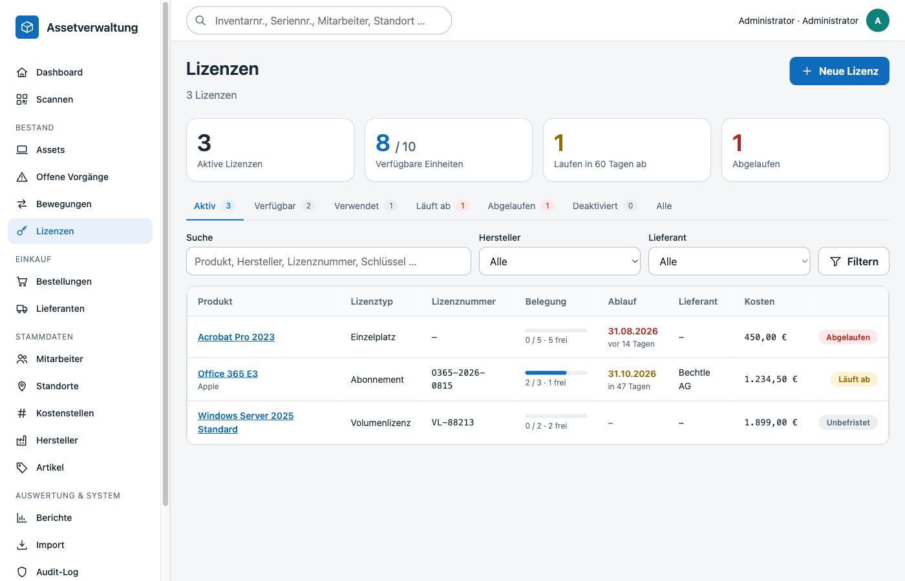
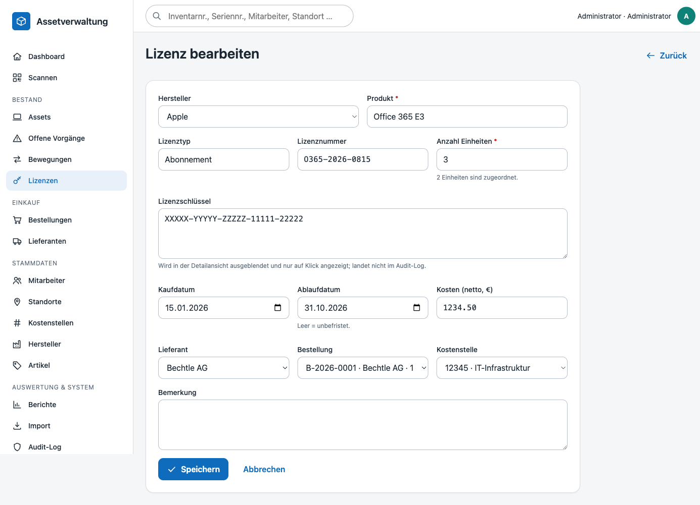
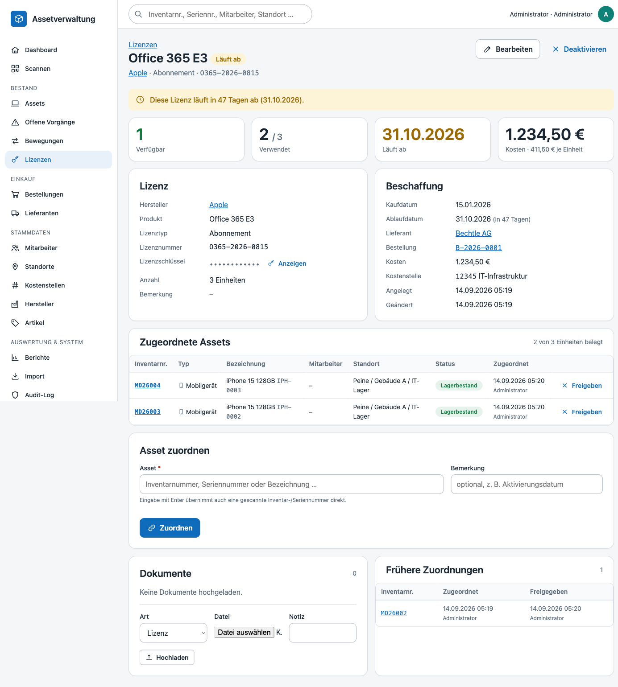
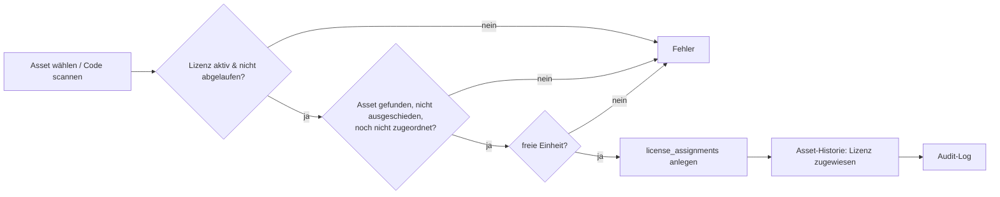
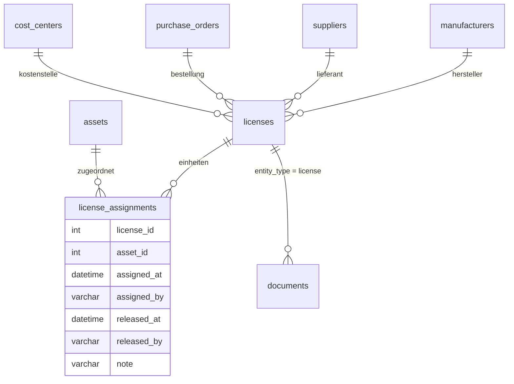

# Lizenzen – Verwaltung, Assetzuordnung, Ablaufstatus

Software-Lizenzen (`licenses`) werden mit Hersteller, Produkt, Lizenztyp, Schlüssel, Anzahl, Kauf-/Ablaufdatum, Lieferant, Kosten und Dokumenten verwaltet. Jede Lizenz hat eine **Anzahl** an Einheiten (Seats), die einzeln **Assets zugeordnet** werden (`license_assignments`). Der **Ablaufstatus** wird aus dem Ablaufdatum berechnet und in Liste, Detail und Dashboard sichtbar gemacht.



## Liste (`/licenses`)

Vier Kennzahlen (aktive Lizenzen, verfügbare/gesamte Einheiten, in 60 Tagen ablaufend, abgelaufen) und Statuskarteireiter mit Zählern:

| Reiter | Inhalt |
|---|---|
| **Aktiv** (Standard) | alle nicht deaktivierten Lizenzen – auch abgelaufene, damit sie nicht aus dem Blick geraten |
| **Verfügbar** | aktive, nicht abgelaufene Lizenzen mit mindestens einer freien Einheit |
| **Verwendet** | aktive Lizenzen mit mindestens einer belegten Einheit |
| **Läuft ab** | Ablaufdatum innerhalb der nächsten 60 Tage |
| **Abgelaufen** | Ablaufdatum überschritten |
| **Deaktiviert** | manuell deaktivierte Lizenzen |
| **Alle** | ohne Filter |

Zusätzlich: Volltext (Produkt, Hersteller, Lizenztyp, Lizenznummer, Schlüssel, Bemerkung), Hersteller und Lieferant. `?expiring=N` filtert auf Lizenzen, die in den nächsten N Tagen ablaufen – so verlinkt das Dashboard (`/licenses?expiring=60`). Die Belegung wird als Balken *belegt / gesamt · frei* angezeigt.

## Felder



| Feld | Bedeutung |
|---|---|
| Hersteller | Auswahl aus den Stammdaten (optional) |
| Produkt | Pflicht, max. 200 Zeichen |
| Lizenztyp | Freitext mit Vorschlägen: Einzelplatz, Volumenlizenz, Abonnement, OEM, Gerätelizenz, Benutzerlizenz, Open Source, Sonstige |
| Lizenznummer | Vertrags-/Bestellnummer des Herstellers |
| Lizenzschlüssel | wird in der Detailansicht maskiert (`••••`) und erst nach Klick auf *Anzeigen* (`?show_key=1`) eingeblendet; im Audit-Log erscheint er nur als `***` |
| Anzahl | Einheiten, 1 … 100 000; darf beim Bearbeiten nicht unter die Zahl der aktiven Zuordnungen sinken |
| Kaufdatum / Ablaufdatum | Ablaufdatum leer = **unbefristet**; darf nicht vor dem Kaufdatum liegen |
| Lieferant, Bestellung, Kostenstelle | Verknüpfung zu Einkauf und Buchhaltung; Bestellung verweist auf `purchase_orders` |
| Kosten | Gesamtkosten; das Detail zeigt zusätzlich den Preis je Einheit |
| Bemerkung | Freitext |

## Ablaufstatus

Der Status wird bei jeder Abfrage aus `expires_at` berechnet (`expiry_status`, `days_left`):

| Status | Bedingung | Darstellung |
|---|---|---|
| `perpetual` | kein Ablaufdatum | Badge *Unbefristet* (neutral) |
| `valid` | Ablauf in mehr als 60 Tagen | Badge *Gültig* (grün) |
| `expiring` | Ablauf innerhalb von 60 Tagen | Badge *Läuft ab* (gelb), Hinweis „läuft in N Tagen ab“, Zähler in Liste und Dashboard |
| `expired` | Ablaufdatum überschritten | Badge *Abgelaufen* (rot), Hinweis im Detail, **Zuordnung gesperrt** |

Zusätzlich kann eine Lizenz **deaktiviert** werden (`is_active = 0`): Sie bleibt mit allen Zuordnungen erhalten, zählt aber nicht mehr in Kennzahlen und kann nicht neu zugeordnet werden. Das Reaktivieren ist jederzeit möglich.

## Assetzuordnung



Im Detail unter **Asset zuordnen** wird ein Asset über den Picker (Suche nach Inventarnummer, Name, Mitarbeiter, Standort) gewählt oder direkt eine **Inventar- oder Seriennummer gescannt/eingetippt** und mit Enter bestätigt – dieselbe Auflösung wie beim Scannen (`MovementService::resolveAsset`). Optional wird eine Bemerkung (z. B. „Installiert am …“) gespeichert.



Prüfungen im `LicenseService::assign()`:

- Lizenz ist aktiv und nicht abgelaufen (sonst `ConflictException`).
- Asset existiert (per ID oder Code) und ist nicht in einem Endstatus (ausgeschieden/entsorgt).
- Dieselbe Lizenz ist dem Asset noch nicht aktiv zugeordnet.
- Es gibt eine freie Einheit (`available_count > 0`); sind alle Einheiten belegt, wird das Formular durch einen Hinweis ersetzt.

Zuordnung, Asset-Historie (`license_assigned`) und Audit-Eintrag werden in einer Transaktion geschrieben.

**Freigeben** setzt `released_at`/`released_by`, schreibt `license_removed` in die Asset-Historie und macht die Einheit sofort wieder verfügbar. Freigegebene Zuordnungen bleiben unter **Frühere Zuordnungen** nachvollziehbar. Die Freigabe ist sowohl auf der Lizenzseite als auch in der **Lizenzen-Karte des Assets** (`/assets/{id}#licenses`) möglich; dort werden alle aktiven Lizenzen des Geräts mit Ablaufstatus angezeigt.

## Dokumente

Rechnungen, Lizenzzertifikate oder Verträge werden wie bei Assets und Bestellungen über die Dokumentenverwaltung hochgeladen (`entity_type = license`, Standardart *Lizenz*).

## Berechtigungen

| Aktion | Berechtigung | Rollen |
|---|---|---|
| Lizenzen ansehen | `licenses.view` | alle Rollen (inkl. Readonly) |
| Anlegen, Bearbeiten, (De-)Aktivieren, Zuordnen, Freigeben | `licenses.manage` | Admin, Assetmanagement, Einkauf |
| Dokumente hochladen/löschen | `documents.manage` | Admin, Assetmanagement, Lager, Einkauf |

## Datenmodell



`used_count` = aktive Zuordnungen (`released_at IS NULL`), `available_count = quantity - used_count`.

## Tests

`tests/Integration/LicenseServiceIntegrationTest.php` deckt Anlage und Validierung (Pflichtfeld, Datumsreihenfolge, Fremdschlüssel, Anzahl ≥ Belegung), die Statusberechnung (unbefristet/läuft ab/abgelaufen), Zuordnung per ID, Inventar- und Seriennummer, alle Sperren (unbekannter Code, Duplikat, Kapazität, abgelaufen, deaktiviert, ausgeschiedenes Asset), Freigabe inkl. Historie, die Listenfilter und die Rollenrechte ab.

```bash
docker compose exec -T app php tests/run.php --integration --filter=LicenseService
```
