# Bestandsmanagement – Entnahme & Retoure

Jede Ausgabe an einen Mitarbeiter (Entnahme) und jede Rücknahme (Retoure) wird als **Bewegung** (`movements`) erfasst. Bewegungen verändern das Asset (Status, Mitarbeiter, Standort, Kostenstelle) und schreiben die Änderungen in die Asset-Historie, sodass sich jede Bewegung nachvollziehen und stornieren lässt.

Der Ablauf ist für das Lager auf dem Smartphone optimiert: Etikett scannen → Mitarbeiter wählen → fertig. Was auf dem Handy nicht bekannt ist (z. B. die Kostenstelle), wird später am Desktop in der Arbeitsliste **Offene Vorgänge** nachgetragen.

## Mobile Erfassung (`/m`)

Die mobile Oberfläche liegt unter `/m` und nutzt ein eigenes Layout mit großen Touch-Zielen (mind. 44 px), unterer Navigationsleiste und Offline-Hinweis. Sie ist auf dem Desktop unter „Scannen“ im Menü erreichbar.

| Scannen | Asset | Entnahme |
|---|---|---|
| 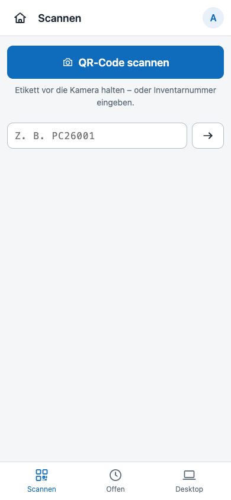 | 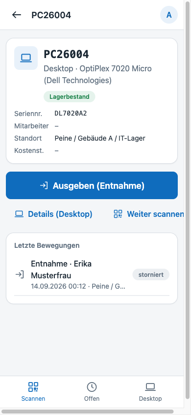 | 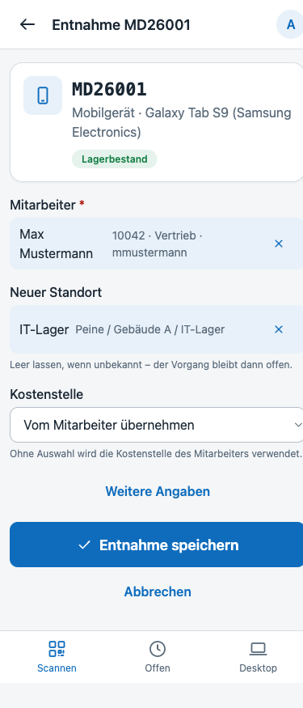 |

| Retoure | Erledigt | Erledigt (offen) |
|---|---|---|
| 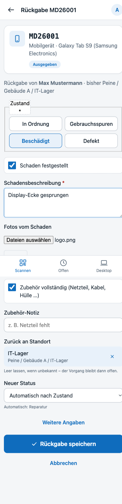 | 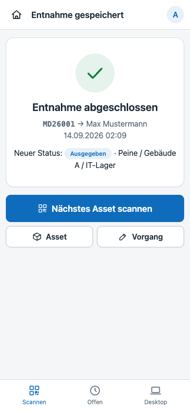 | 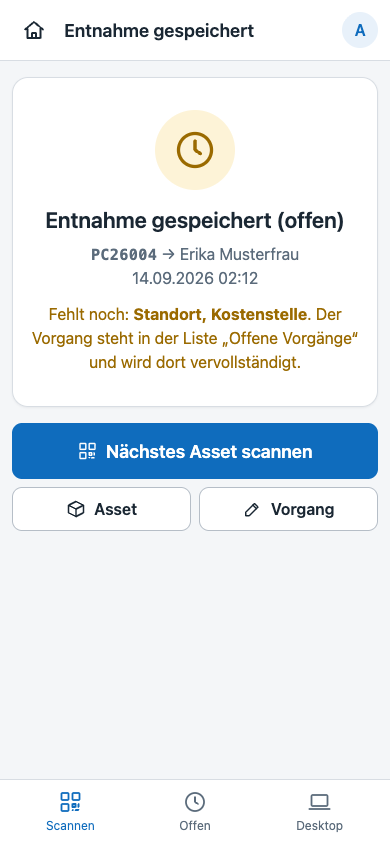 |

### Scannen

`/m` öffnet den Scanner. Er liest QR-Codes der Inventaretiketten (URL `…/a/{Inventarnummer}`) sowie beliebige Barcodes/QR-Codes mit Inventar- oder Seriennummer. Alternativ kann die Nummer eingetippt oder ein Bluetooth-/USB-Handscanner verwendet werden (Eingabe + Enter).

- Der Scanner nutzt, wenn vorhanden, die native `BarcodeDetector`-API des Browsers (Chrome/Edge auf Android, Safari ab iOS 17) und fällt sonst auf die mitgelieferte Bibliothek **jsQR** zurück (`public/js/vendor/jsqr.js`, Apache-2.0, Lizenz liegt daneben). Es werden keine externen Ressourcen geladen.
- Der Kamerazugriff funktioniert nur über **HTTPS** (oder `localhost`). Ohne sichere Verbindung zeigt die Seite einen Hinweis und bietet die manuelle Eingabe an.
- `GET /m/lookup?code=…` löst den gescannten Wert auf: vollständige URL → Inventarnummer, sonst Inventarnummer (Groß-/Kleinschreibung egal), sonst Seriennummer. Unbekannte Codes führen mit Meldung zurück zum Scanner.

### Asset-Karte (`/m/asset/{Inventarnummer}`)

Zeigt Status, Mitarbeiter, Standort und Kostenstelle und bietet je nach Zustand die passende Aktion:

| Asset-Zustand | Aktionen |
|---|---|
| frei (kein Mitarbeiter, Status nicht final) | **Ausgeben** |
| an Mitarbeiter ausgegeben | **Zurücknehmen** – eine erneute Ausgabe ist erst nach der Rückgabe möglich |
| Status final (z. B. ausgemustert) | keine Bewegung möglich |

### Entnahme (`/m/checkout`)

Pflichtfeld ist nur der **Mitarbeiter** (Autocomplete über `/api/employees/search`). Optional:

- **Standort** – wird bewusst *nicht* aus dem Asset vorbelegt (das Gerät verlässt ja das Lager). Bleibt er leer, wird der Vorgang als „offen“ markiert.
- **Kostenstelle** – Vorbelegung in dieser Reihenfolge: Eingabe → Kostenstelle des Mitarbeiters → bisherige Kostenstelle des Assets. Ist nichts davon vorhanden, bleibt der Vorgang offen.
- Rückgabe geplant am, Notiz, Fotos (Mehrfachauswahl, Kamera direkt).

Das Asset wird sofort auf **Ausgegeben** gesetzt und dem Mitarbeiter zugeordnet – auch wenn Angaben fehlen. Fehlende Felder erscheinen in der Arbeitsliste.

### Retoure (`/m/return`)

Pflichtfeld ist der **Zustand**: *In Ordnung*, *Gebrauchsspuren*, *Beschädigt*, *Defekt*. Bei Schaden ist eine Beschreibung erforderlich; Fotos werden empfohlen. Der **Standort** wird mit dem Herkunftsstandort der letzten Entnahme vorgeschlagen (meist das Lager); ohne Standort bleibt der Vorgang offen.

Der Zielstatus ergibt sich aus dem Zustand und kann überschrieben werden:

| Zustand | Zielstatus (Standard) |
|---|---|
| In Ordnung / Gebrauchsspuren | Lagerbestand |
| Beschädigt (oder Häkchen „Schaden“) | Reparatur |
| Defekt | Defekt |
| – manuell – | Ausmustern (benötigt `assets.retire`) |

Die Mitarbeiterzuordnung wird bei jeder Retoure entfernt.

## Desktop: Bewegungen & offene Vorgänge

| Bewegungen | Offene Vorgänge |
|---|---|
| 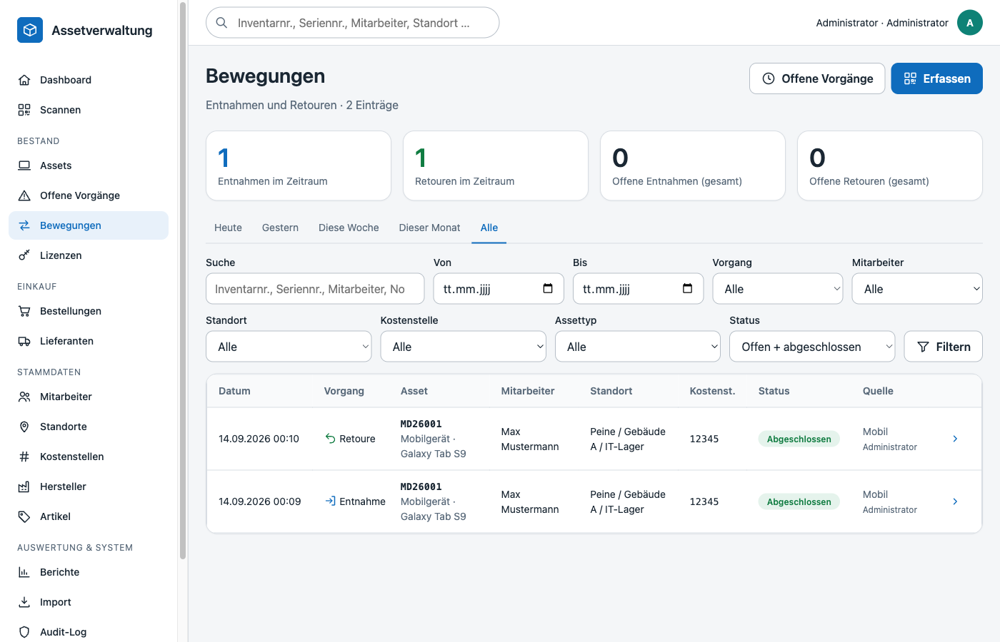 | 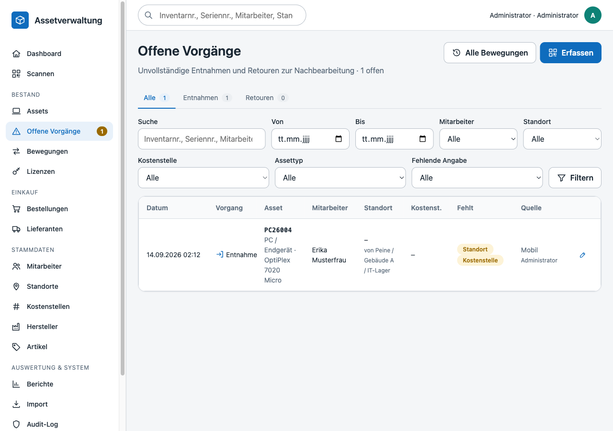 |

- **Bewegungen** (`/movements`) – Liste mit Zeitraum-Tabs (heute, gestern, Woche, Monat, alle, eigener Zeitraum), Filter nach Typ, Status, Quelle, Suchtext; Kennzahlen (Entnahmen/Retouren im Zeitraum, offene Vorgänge).
- **Offene Vorgänge** (`/movements/open`) – Arbeitsliste aller Bewegungen mit fehlenden Angaben. Die Anzahl erscheint als Badge im Menü und auf dem Dashboard.

### Vorgang bearbeiten und abschließen

| offener Vorgang | abgeschlossener Vorgang |
|---|---|
| 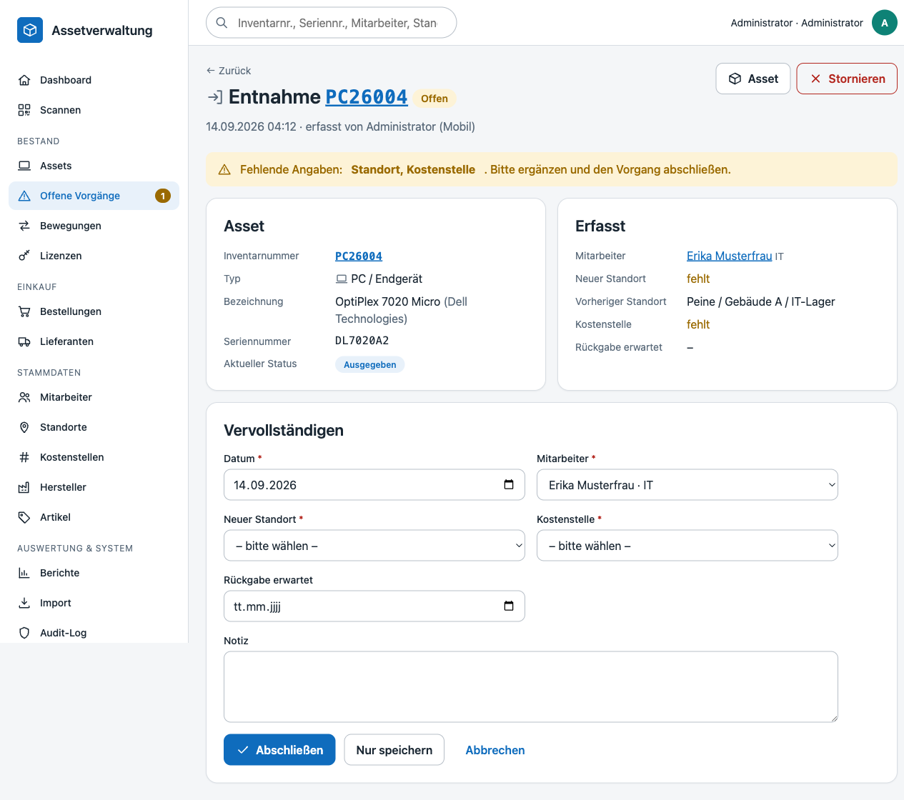 | 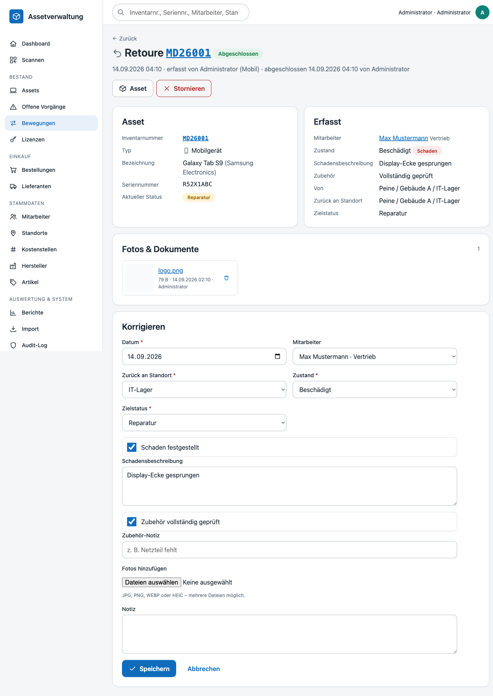 |

Auf der Detailseite (`/movements/{id}`) lassen sich Mitarbeiter, Standort, Kostenstelle, Datum, geplante Rückgabe, Zustand und Notiz ändern sowie weitere Fotos hochladen. **Speichern & abschließen** prüft, ob alle Pflichtangaben vorhanden sind, und setzt den Status auf *abgeschlossen*. Solange die Bewegung die jüngste des Assets ist, werden Änderungen auch auf das Asset übertragen; ältere Bewegungen werden nur dokumentarisch korrigiert.

### Stornieren

Nur die **jüngste nicht stornierte Bewegung** eines Assets kann storniert werden (Grund erforderlich). Dabei werden alle Feldänderungen, die diese Bewegung am Asset vorgenommen hat, anhand der Historie rückgängig gemacht (Status, Mitarbeiter, Standort, Kostenstelle). Die Stornierung selbst wird in der Asset-Historie und im Audit-Log vermerkt.

### Assetdetail

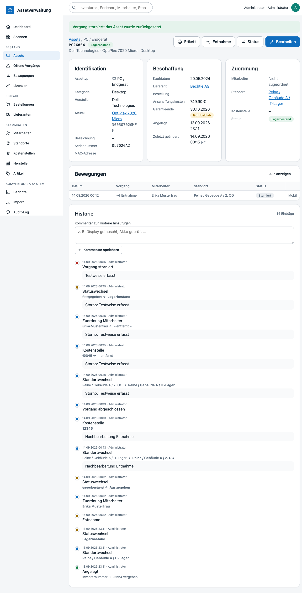

Die Assetdetailseite zeigt die letzten Bewegungen sowie die Ereignisse *Entnahme/Retoure abgeschlossen* und *storniert* in der Historie.

## Fotos & Dokumente

Fotos werden als Dokumente (`documents`, Typ `photo`, Entität `movement`) unter `storage/uploads/` außerhalb des Webroots gespeichert und über `GET /documents/{id}` (Anzeige) bzw. `?download=1` ausgeliefert. Erlaubt sind Bilder (`png, jpg, jpeg, webp, heic`), der MIME-Typ wird serverseitig mit `finfo` geprüft; die maximale Größe steuert `MAX_UPLOAD_BYTES` (Standard 20 MB). Löschen benötigt `documents.manage`.

## Idempotenz & Konflikte

Jede Bewegung kann eine **Transaktions-ID** (`client_transaction_id`, vom Formular erzeugt) tragen. Wird dieselbe ID erneut gesendet – etwa nach einem Verbindungsabbruch oder bei der Offline-Synchronisation –, liefert der Server die bereits gespeicherte Bewegung zurück, statt eine zweite anzulegen.

Optional übermittelt der Client die **Asset-Version** (`asset_version`), die er beim Scannen gesehen hat. Wurde das Asset zwischenzeitlich geändert, wird die Bewegung mit einer Konfliktmeldung abgelehnt und muss neu erfasst werden. Die Quelle (`source`: Desktop, Mobil, Offline-Sync, Import) wird pro Bewegung gespeichert. Wie Vorgänge ohne Verbindung erfasst und später übertragen werden, beschreibt [Offline-Betrieb](offline.md).

Zeitstempel werden in UTC gespeichert und in der Oberfläche in Europe/Berlin angezeigt; das Bewegungsdatum (`movement_date`) ist ein lokales Datum.

## Berechtigungen

| Recht | erlaubt |
|---|---|
| `movements.view` | Bewegungen, offene Vorgänge und mobile Ansicht lesen |
| `movements.checkout` | Entnahme erfassen |
| `movements.return` | Retoure erfassen |
| `movements.complete` | Vorgänge bearbeiten, abschließen, stornieren |
| `assets.retire` | Zielstatus *Ausmustern* bei der Retoure |
| `documents.manage` | Fotos löschen |

Die Rollen *Administrator*, *Assetmanagement* und *Lager* besitzen alle `movements.*`-Rechte; *Lager* darf nicht ausmustern.

## Tests

`tests/Integration/MovementServiceIntegrationTest.php` deckt Auflösung, Entnahme (vollständig/offen/Kostenstellen-Fallback), Validierung und Berechtigungen, Idempotenz, Versionskonflikte, finale Assets, Retoure (Standardstatus, Schaden, offen, Ausmustern), Bearbeiten/Abschließen, Stornieren sowie Suche und Kennzahlen ab:

```bash
docker compose exec app php tests/run.php --integration --filter=Movement
```
