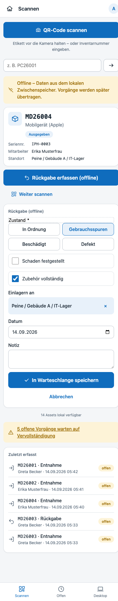
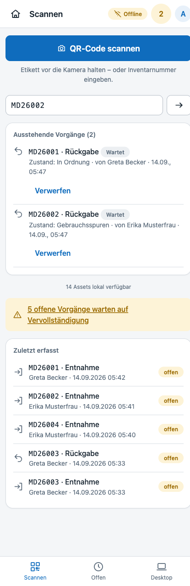
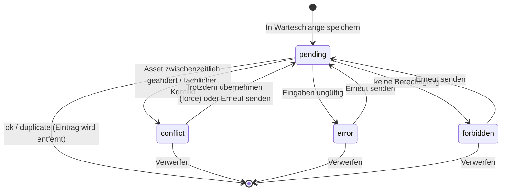
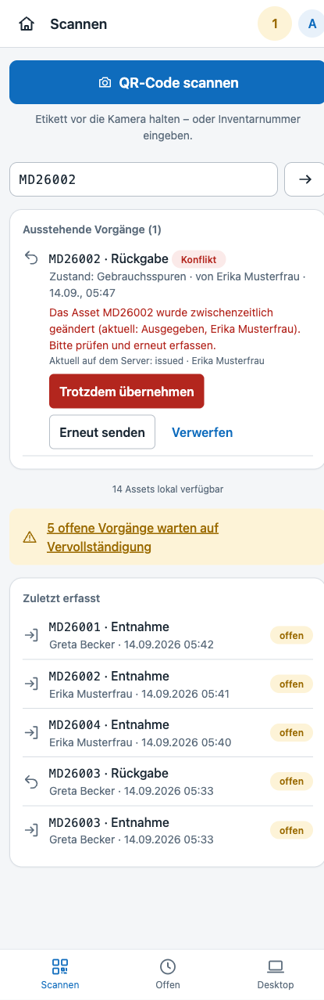

# Offline-Betrieb – PWA, Warteschlange, Synchronisation

Der mobile Bereich (`/m`) ist als **Progressive Web App** installierbar und funktioniert ohne Verbindung zum Server weiter: Assets werden aus einem lokalen Zwischenspeicher angezeigt, **Entnahmen und Rückgaben** werden in eine Warteschlange gestellt und sobald wieder Netz da ist **idempotent** übertragen. Ein Vorgang wird dabei niemals doppelt angelegt; wurde ein Asset zwischenzeitlich auf dem Server geändert, wird der Konflikt angezeigt statt stillschweigend überschrieben.



## Bausteine

| Baustein | Datei | Aufgabe |
|---|---|---|
| Service Worker | `public/sw.js` | cacht die App-Shell des mobilen Bereichs (Seiten, CSS, JS, Icons, `offline.html`) |
| Manifest | `public/manifest.webmanifest` | Installierbarkeit („Zum Startbildschirm hinzufügen“), Icons, Startseite `/m` |
| Offline-Kern | `public/js/offline.js` (`window.Offline`) | IndexedDB-Zwischenspeicher, Warteschlange, Synchronisation, Ereignisse |
| Offline-Oberfläche | `public/js/offline-ui.js` | Assetkarte, Offline-Formulare, Warteschlangenliste auf der Scan-Seite |
| Bootstrap-API | `GET /api/offline/bootstrap` | liefert Assets und Stammdaten für den Zwischenspeicher |
| Sync-API | `POST /api/offline/sync` | nimmt eine Liste von Transaktionen an und verarbeitet sie einzeln |
| Service | `App\Services\OfflineSyncService` | Bootstrap-Zusammenstellung, Verarbeitung je Transaktion, Fotoablage |

Es kommen keine externen Bibliotheken zum Einsatz; IndexedDB, Cache-API und Service Worker sind Browserstandards.

## Caching-Strategie des Service Workers

| Anfrage | Strategie |
|---|---|
| `/api/*`, `/login`, `/logout`, alle Nicht-GET-Anfragen | werden **nicht** angefasst (immer Netz) |
| Statische Dateien (`.css .js .svg .png .webmanifest .woff2`) | **Netz zuerst**, Antwort wird ohne `?v=`-Query im Cache abgelegt; ohne Netz wird die zuletzt gesehene Version ausgeliefert. Der Versions-Parameter der Seiten (`?v=<mtime>`) bleibt damit wirksam, offline gibt es trotzdem immer einen Treffer. |
| Seiten unter `/m` und `/m/*` | **Netz zuerst**, erfolgreiche Antworten werden gecacht; ohne Netz: gecachte Seite → Scan-Seite `/m` → `offline.html` |

Beim Aktivieren einer neuen Version (`CACHE_NAME`) werden alte Caches gelöscht. Die App-Shell wird beim Installieren vorab geladen (`Promise.allSettled`, damit eine fehlende Datei die Installation nicht blockiert).

Ruft der Nutzer offline `/m/lookup?code=…` auf (z. B. über einen QR-Code oder aus dem Verlauf), liefert der Service Worker die Scan-Seite als Ersatz. `offline-ui.js` erkennt das am Pfad `/m/lookup` und löst den Code direkt aus dem lokalen Zwischenspeicher auf.

## Lokaler Zwischenspeicher (IndexedDB `assets-offline`)

| Store | Inhalt | Index |
|---|---|---|
| `meta` | `bootstrap_at`, `asset_count`, `permissions`, `user` | – |
| `assets` | kompakte Assetdaten (Nummer, Seriennummer, Name, Typ, Status, Version, Mitarbeiter, Standort, Kostenstelle) aller nicht endgültig abgeschlossenen Assets | `inventory_key`, `serial_key` (normalisiert) |
| `employees`, `locations`, `cost_centers` | aktive Stammdaten für die Auswahlfelder | – |
| `queue` | wartende Vorgänge, Schlüssel `client_transaction_id` | – |

Der Bootstrap wird beim Öffnen der Scan-Seite geladen, wenn er älter als **10 Minuten** ist, außerdem nach jeder erfolgreichen Synchronisation (die lokalen Daten sind dann veraltet) und beim Wechsel von offline nach online. Die Scan-Seite zeigt unten den Stand („14 Assets lokal verfügbar“).

Codes werden wie beim Server-Lookup normalisiert: URL → letztes Pfadsegment, Leerzeichen und Bindestriche entfernt, Großschreibung. So findet der Zwischenspeicher `MD26004`, `md 26004` und die QR-URL `https://…/a/MD26004` gleichermaßen, ebenso Seriennummern.

## Ablauf offline

1. Der Nutzer scannt oder tippt einen Code. Ist der Browser offline (`navigator.onLine === false`) oder wird die Scan-Seite als Ersatz für `/m/lookup` ausgeliefert, löst `offline-ui.js` den Code lokal auf.
2. Die **Offline-Assetkarte** zeigt Nummer, Typ, Status, Seriennummer, Mitarbeiter und Standort aus dem Zwischenspeicher – mit dem Hinweis, dass die Daten lokal sind.
3. Je nach Zustand und Berechtigung erscheint **Ausgeben (offline)** (Asset nicht ausgegeben, `movements.checkout`) oder **Rückgabe erfassen (offline)** (Asset ausgegeben, `movements.return`).
4. Das Formular entspricht dem Online-Formular: Mitarbeiter/Standort werden aus dem lokalen Stammdatenbestand gesucht, Zustand als Kacheln, Schaden mit Beschreibung und bis zu 4 Fotos (als Base64 in der Warteschlange), Zubehör, Einlagerungsort (vorbelegt mit dem Standort des Assets), Datum, Notiz.
5. **In Warteschlange speichern** legt den Vorgang mit einer eindeutigen `client_transaction_id` (UUID), der gesehenen `asset_version` und dem Status *Wartet* ab. Der Zähler in der Kopfzeile zeigt die Anzahl offener Vorgänge.

Auch die regulären Formulare `/m/checkout` und `/m/return` sind offline nutzbar: Wird eines davon ohne Verbindung abgeschickt, fängt `mobile.js` den Versand ab, stellt den Vorgang (inkl. Fotos) in die Warteschlange und leitet zu `/m?queued=1` weiter. Die dabei verwendete Transaktions-ID ist dieselbe, die der Server beim Rendern des Formulars vergeben hat.



## Synchronisation

Sobald der Browser wieder online ist (`online`-Ereignis, Öffnen der Scan-Seite, Klick auf *Jetzt senden*), werden alle Vorgänge mit Status *Wartet* in **einem** Request an `POST /api/offline/sync` gesendet. Ein Sync läuft nie doppelt parallel; ein zweiter Aufruf erhält dasselbe Promise.



Ergebnisse je Vorgang:

| Status | Bedeutung | Reaktion des Clients |
|---|---|---|
| `ok` | Bewegung angelegt (Quelle `offline_sync`) | Eintrag wird entfernt |
| `duplicate` | Transaktions-ID war bereits gespeichert | Eintrag wird entfernt – **kein zweiter Vorgang** |
| `conflict` | Asset wurde zwischenzeitlich geändert (Versionskonflikt) oder ein fachlicher Konflikt (z. B. bereits an jemand anderen ausgegeben) | Eintrag bleibt mit Meldung und Serverstand stehen |
| `error` | Validierungsfehler (z. B. Mitarbeiter fehlt) | Eintrag bleibt mit Fehlermeldung stehen |
| `forbidden` | Nutzer darf den Vorgang nicht buchen | Eintrag bleibt stehen |

Jede Transaktion wird **unabhängig** verarbeitet – ein Konflikt blockiert die anderen Vorgänge nicht. Nach mindestens einem Erfolg wird der Bootstrap neu geladen. Ein Toast fasst zusammen („2 Vorgänge übertragen“ bzw. „0 übertragen, 1 mit Problemen – siehe ausstehende Vorgänge“).

### Konflikte



Bei einem **Versionskonflikt** zeigt der Eintrag die Meldung und den aktuellen Serverstand (Status, Mitarbeiter). Der Nutzer entscheidet:

- **Trotzdem übernehmen** – sendet den Vorgang mit `force: true`; der Server lässt dann die Versionsprüfung weg, alle fachlichen Regeln gelten weiterhin. Die Schaltfläche erscheint nur bei Versionskonflikten; fachliche Konflikte (Asset bereits ausgegeben, nicht ausgegeben, ausgemustert) können nicht überschrieben werden.
- **Erneut senden** – unverändert noch einmal versuchen.
- **Verwerfen** – Eintrag nach Rückfrage löschen.

Nicht angemeldet (`401`) oder abgelaufene Sitzung bzw. ungültiges CSRF-Token (`403`): die Warteschlange bleibt vollständig erhalten, der Nutzer erhält einen Hinweis und die Übertragung startet nach der Anmeldung automatisch.

## API

### `GET /api/offline/bootstrap` (Berechtigung `assets.view`)

```json
{
  "generated_at": "2026-09-14T03:40:00+00:00",
  "user": { "id": 1, "display_name": "Admin" },
  "permissions": { "checkout": true, "return": true, "retire": true },
  "assets": [ { "id": 14, "inventory_number": "MD26004", "serial_number": "IPH-0003", "name": "…", "version": 2,
                "type": "Mobilgerät", "type_code": "MD", "manufacturer": "Apple",
                "status_code": "issued", "status_name": "Ausgegeben", "status_color": "info",
                "employee_id": 2, "employee_name": "Erika Musterfrau", "location_id": 6, "location_path": "Peine / Gebäude A / IT-Lager", "cost_center_id": null } ],
  "employees": [ { "id": 2, "name": "Erika Musterfrau", "meta": "10002 · IT" } ],
  "locations": [ { "id": 6, "name": "IT-Lager", "meta": "Peine / Gebäude A / IT-Lager" } ],
  "cost_centers": [ { "id": 1, "number": "4711", "description": "IT" } ],
  "conditions": { "ok": "In Ordnung", "worn": "Gebrauchsspuren", "damaged": "Beschädigt", "defective": "Defekt" },
  "return_targets": { "in_stock": "Lagerbestand", "repair": "Reparatur", "defective": "Defekt", "retired": "Ausmustern" }
}
```

Endgültig abgeschlossene Assets (Status `is_final`, z. B. ausgemustert) sind nicht enthalten.

### `POST /api/offline/sync` (angemeldet; Berechtigung wird je Vorgang geprüft)

Header: `Content-Type: application/json`, `X-CSRF-Token: <meta csrf-token>`. Höchstens **100** Transaktionen je Aufruf.

```json
{ "transactions": [
  { "client_transaction_id": "0b76ff58-8d2c-4b05-90d1-396dcd41566c", "type": "checkout", "force": false,
    "payload": { "asset_id": 14, "asset_version": 2, "employee_id": 2, "location_id": 6, "cost_center_id": "", "movement_date": "2026-09-14", "note": "" } },
  { "client_transaction_id": "bd854589-2cc4-481c-a092-53b7fc7c23e5", "type": "return",
    "payload": { "asset_id": 13, "asset_version": 3, "condition_code": "damaged", "has_damage": "1", "damage_description": "Riss im Display", "accessories_checked": "1", "to_location_id": 6 },
    "photos": [ { "name": "riss.jpg", "type": "image/jpeg", "data": "data:image/jpeg;base64,/9j/4AAQ…" } ] }
] }
```

Antwort (`results` in derselben Reihenfolge):

```json
{ "results": [
  { "client_transaction_id": "0b76…", "type": "checkout", "status": "ok", "movement_id": 7, "movement_status": "open", "message": "Entnahme gespeichert." },
  { "client_transaction_id": "bd85…", "type": "return", "status": "conflict",
    "message": "Das Asset MD26003 wurde zwischenzeitlich geändert (aktuell: Reparatur). Bitte prüfen und erneut erfassen.",
    "conflict": { "asset_id": 13, "version": 4, "status": "repair", "employee_name": null } }
], "server_time": "2026-09-14T03:41:18+00:00" }
```

Regeln der Verarbeitung (`OfflineSyncService::process`):

- `client_transaction_id` muss `^[A-Za-z0-9-]{8,36}$` entsprechen, `type` ist `checkout` oder `return`; sonst `error`.
- Existiert bereits eine Bewegung mit dieser ID → `duplicate` mit der vorhandenen `movement_id`. Die Eindeutigkeit ist zusätzlich durch den Unique-Index `uq_movements_client_tx` abgesichert.
- `force: true` entfernt `asset_version` aus der Payload (nur nach Bestätigung durch den Nutzer).
- Die Buchung selbst übernimmt `MovementService::checkout` bzw. `returnAsset` mit Quelle `offline_sync` – dieselben Validierungen, Berechtigungen (`movements.checkout` / `movements.return`), Historie und Audit-Einträge wie online.
- Fotos einer Rückgabe (max. 8, je max. 8 MB, nur Bildformate) werden Base64-dekodiert und über den `DocumentService` als Dokument vom Typ `photo` an die Bewegung gehängt. Abgelehnte Fotos erscheinen als `warnings`; die Bewegung bleibt gespeichert.

## Grenzen

- Der Zwischenspeicher umfasst höchstens 20 000 Assets (kompakte Felder); Historie, Dokumente und Bestellungen sind offline nicht verfügbar.
- Offline gebuchte Vorgänge sind bis zur Übertragung nur auf dem jeweiligen Gerät sichtbar (IndexedDB des Browsers). Wird der Browserspeicher gelöscht, gehen wartende Vorgänge verloren – der Zähler in der Kopfzeile macht offene Vorgänge sichtbar.
- Ausmustern, Anlegen von Assets und Stammdatenänderungen sind bewusst nur online möglich.

## Tests

`tests/Integration/OfflineSyncServiceIntegrationTest.php` deckt Bootstrap (Inhalt, Berechtigungsflags je Rolle, Ausschluss ausgemusterter Assets) und Synchronisation ab: Buchung mit Quelle `offline_sync`, Idempotenz (gleiche ID zweimal, auch innerhalb eines Batches), Versionskonflikt mit Serverstand, `force`-Override, fachlicher Konflikt trotz `force`, Fehlerbericht je Transaktion, Unabhängigkeit der Transaktionen, `readonly`-Rolle, Batch-Limit und Rückgabe mit Base64-Foto inkl. abgelehntem Foto.
