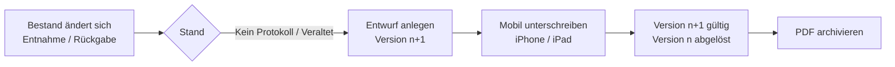

# Übergabeprotokoll

Für jeden Mitarbeiter wird ein **Übergabeprotokoll** über die ihm ausgegebenen, protokollrelevanten Arbeitsmittel geführt. Der Mitarbeiter unterschreibt digital auf einem iPhone oder iPad; jede Unterschrift erzeugt eine neue **Version**, die als PDF archiviert wird. Es gilt immer die zuletzt unterschriebene Version. Der Aufbau des Protokolls ist für Administratoren im **Baukasten** anpassbar.

## Voraussetzung: Artikelstamm

Assets verweisen verpflichtend auf einen Stammartikel (Stammdaten → Artikel). Nur Artikel mit gesetzter Checkbox **„Relevant für Übergabeprotokoll“** erscheinen im Protokoll – typischerweise Notebooks, Smartphones, Token oder Schlüssel, nicht aber Verbrauchsmaterial oder Zubehör.

- Bei der Inventarisierung (Formular, CSV-Import, Wareneingang) sind nur vorhandene Artikel wählbar. Das Asset-Formular nutzt ein Textfeld mit Vervollständigung und Auswahlmenü (`GET /api/articles/search`).
- Artikel werden wie Hersteller **phonetisch auf Dubletten** geprüft (Kölner Phonetik): Während der Eingabe zeigt `GET /api/articles/check` ähnliche Artikel an; beim Speichern muss eine gefundene Ähnlichkeit ausdrücklich bestätigt werden.

Protokollrelevant sind alle Assets eines Mitarbeiters, deren Artikel relevant ist und deren Status kein Endstatus ist (`asset_statuses.is_final = 0`).

## Ablauf

1. **Übersicht** (`/handover`, Navigation „Übergabeprotokolle“): alle aktiven Mitarbeiter mit protokollrelevanten Assets und dem Stand ihres gültigen Protokolls.
   - **Aktuell** – das gültige Protokoll deckt genau den aktuellen Bestand ab.
   - **Veraltet** – der Bestand hat sich seit der Unterschrift geändert (Vergleich über `asset_fingerprint`, SHA-256 der sortierten Asset-IDs).
   - **Entwurf offen** – eine neue Version wartet auf die Unterschrift.
   - **Kein Protokoll** – noch keine unterschriebene Version vorhanden.
2. **Entwurf anlegen** (`handover.manage`, Button „Protokoll erstellen“ in der Übersicht, beim Mitarbeiter oder unter `/handover/employee/{id}`). Dabei werden Mitarbeiterdaten, Assets und die aktuelle Vorlage **eingefroren** (Snapshots) und die nächste Versionsnummer vergeben. Je Mitarbeiter ist höchstens ein Entwurf offen; er kann jederzeit auf den aktuellen Bestand aktualisiert oder mit Begründung storniert werden.
3. **Unterschrift auf dem Mobilgerät** (`handover.sign`): Auf iPhone/iPad erscheinen unter dem Tab **„Protokolle“** (`/m/handover`) alle offenen Entwürfe. Die Seite zeigt das vollständige Protokoll, Pflichtbestätigungen als Checkboxen und ein Unterschriftsfeld (Finger oder Apple Pencil, `public/js/signature-pad.js` – nach dem Vorbild von [PatSign](https://github.com/dareinelt/PatSign)). Beim Öffnen wird der Entwurf automatisch auf den aktuellen Bestand gebracht, damit nie ein veralteter Stand unterschrieben wird.
4. **Speichern**: Die Unterschrift wird als PNG-Dokument abgelegt (`documents`, Typ `signature`), das gerenderte HTML wird im Protokoll eingefroren, Gerät und IP werden protokolliert, alle bisher gültigen Versionen des Mitarbeiters werden auf **abgelöst** gesetzt und das PDF wird erzeugt (Typ `handover_protocol`). Alles wird im Audit-Log festgehalten (`create`, `sign`, `pdf`, `cancel`).

### Versionierung

| Status | Bedeutung |
|---|---|
| `draft` | Entwurf, noch nicht unterschrieben; Bestand und Vorlage werden beim Öffnen aktualisiert |
| `signed` | die **gültige** Version des Mitarbeiters (höchstens eine) |
| `superseded` | frühere unterschriebene Version; bleibt unveränderlich mit PDF archiviert |
| `cancelled` | verworfener Entwurf (nur Entwürfe lassen sich stornieren) |

Die Protokollnummer lautet `UP-<Personalnummer>-<Version>` (ohne Personalnummer `UP-E<Mitarbeiter-ID>-<Version>`). Alle Versionen eines Mitarbeiters sind unter `/handover/employee/{id}` einsehbar; das PDF (oder ersatzweise eine Druckansicht) liegt unter `/handover/{id}/pdf`.

## Vorlage anpassen (Baukasten)

Administration → **Übergabeprotokoll-Vorlage** (`/admin/handover-template`, Recht `handover.template`). Die Vorlage ist eine Liste von Blöcken, die hinzugefügt, sortiert, dupliziert, entfernt und einzeln konfiguriert werden; rechts zeigt eine Live-Vorschau mit Beispieldaten das Ergebnis.

| Block | Einstellungen |
|---|---|
| Überschrift | Text (mit Platzhaltern), Größe |
| Textabsatz | Freitext mit Zeilenumbrüchen und Platzhaltern; Stil normal / klein / fett / gedämpft |
| Protokolldaten | Auswahl aus Protokollnummer, Version, Datum, Unternehmen, Aussteller, Anzahl |
| Mitarbeiterdaten | Überschrift; Felder Name, Vor-/Nachname, Personalnummer, Benutzername, E-Mail, Telefon, Abteilung, Position, Standort, Kostenstelle |
| Tabelle der Arbeitsmittel | Überschrift; Spalten Inventarnummer, Typ, Artikel, Hersteller, Kategorie, Seriennummer, MAC, IMEI, Ausgegeben am, Rückgabe bis, Bemerkung; Text bei leerer Liste |
| Bestätigung | Text; Pflicht (muss vor der Unterschrift angekreuzt werden – Prüfung im Browser und am Server) |
| Unterschriftsfeld | Mitarbeiter (digital) oder Aussteller (Name des angemeldeten Benutzers); Beschriftung |
| Trennlinie / Abstand | – / Höhe |

Platzhalter in Texten: `{mitarbeiter}`, `{vorname}`, `{nachname}`, `{personalnummer}`, `{abteilung}`, `{position}`, `{firma}`, `{datum}`, `{uhrzeit}`, `{protokollnummer}`, `{version}`, `{aussteller}`, `{anzahl}`.

Eine Vorlage benötigt mindestens ein Unterschriftsfeld für den Mitarbeiter. Änderungen gelten für **künftig angelegte** Protokolle; offene Entwürfe übernehmen die neue Vorlage beim nächsten Öffnen, unterschriebene Versionen behalten ihren eingefrorenen Aufbau. Die Standardvorlage wird mit `database/seeders/002_handover_template.sql` angelegt.

## PDF-Dienst

Das PDF entsteht serverseitig in einem eigenen Container `pdf` (`docker/pdf/`, Python 3 + [WeasyPrint](https://weasyprint.org/)). Er ist nur im Docker-Netz erreichbar und lädt keine externen Ressourcen (nur eingebettete `data:`-URIs, z. B. die Unterschrift).

| Variable | Bedeutung |
|---|---|
| `PDF_SERVICE_URL` | Basis-URL des Dienstes, Standard `http://pdf:8000`; leer = PDF-Erzeugung deaktiviert |
| `PDF_SERVICE_TIMEOUT` | Zeitlimit in Sekunden (Standard 30) |

Schnittstelle: `POST /render` mit vollständigem HTML im Body liefert `application/pdf`; `GET /health` antwortet `ok`. Ist der Dienst beim Unterschreiben nicht erreichbar, wird die Unterschrift trotzdem gespeichert (Inhalt und Signatur liegen in der Datenbank bzw. unter `storage/uploads`); das PDF lässt sich danach über **„PDF erzeugen“** am Protokoll nachholen. Ohne PDF liefert `/handover/{id}/pdf` eine Druckansicht des eingefrorenen HTML.

## Rechte

| Recht | Bedeutung | Rollen |
|---|---|---|
| `handover.view` | Übersicht, Versionen, PDFs einsehen | alle Leserollen |
| `handover.manage` | Entwürfe anlegen, aktualisieren, stornieren, PDF erzeugen | Administrator, Assetmanagement, Lager |
| `handover.sign` | mobile Unterschriftsseite aufrufen und Unterschrift speichern | Administrator, Assetmanagement, Lager |
| `handover.template` | Vorlage im Baukasten bearbeiten | Administrator |

## Routen

| Methode | Pfad | Zweck |
|---|---|---|
| GET | `/handover` | Übersicht je Mitarbeiter (Filter `q`, `state`) |
| GET | `/handover/employee/{id}` | Stand, Abweichungen und alle Versionen eines Mitarbeiters |
| POST | `/handover/employee/{id}/draft` | neuen Entwurf (nächste Version) anlegen |
| GET | `/handover/{id}` | Protokoll anzeigen |
| GET | `/handover/{id}/pdf` | PDF (`?download=1` als Download) bzw. Druckansicht |
| POST | `/handover/{id}/refresh` · `/cancel` · `/pdf` | Entwurf aktualisieren · Entwurf stornieren · PDF (neu) erzeugen |
| GET | `/m/handover` | offene Entwürfe auf dem Mobilgerät |
| GET/POST | `/m/handover/{id}/sign` | Unterschriftsseite / Unterschrift speichern (`signature_data` als PNG-Data-URL, `confirmations[]`) |
| GET/POST | `/admin/handover-template` | Baukasten anzeigen / speichern (`blocks` als JSON) |
| POST | `/admin/handover-template/preview` | Vorschau ungespeicherter Blöcke (JSON) |
